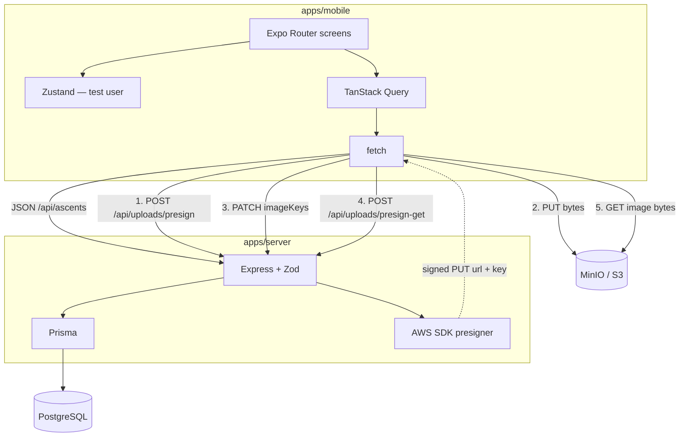

# Boulder Logs

A phone diary for **indoor bouldering**. A climber logs problems (route name, grade, attempts, send vs project, notes), photos, and a short **beta clip** so they can review the sequence after the session. This is a CS624 team project.

Product freeze: [`documents/refine/REQUIREMENTS.md`](documents/refine/REQUIREMENTS.md).  
What each library is for: [`documents/refine/STACK.md`](documents/refine/STACK.md).  
Frontend (screens, components, data flow): [`documents/refine/FRONTEND.md`](documents/refine/FRONTEND.md).  
Backend (routes, Prisma, presign): [`documents/refine/BACKEND.md`](documents/refine/BACKEND.md).  
How to run and test: [`DEVELOPMENT.md`](DEVELOPMENT.md).  
Build order (historical slices): [`documents/refine/ROADMAP.md`](documents/refine/ROADMAP.md).

## What you can do today

- **Home** — stats from the same ascent list (count, send rate, this week) plus recent logs.
- **Logbook** — list, create, edit, delete climbs for one seeded test user.
- **Profile** — shows that test climber (not real login).
- **Photos** — pick from the library, upload to object storage, save keys on the ascent, view them again from signed URLs.
- **Beta clip** — pick one existing video (`mp4` / `mov` / `webm`), upload the same way as photos, play it on the log.

There is **no password, no multi-user UI, and no offline cache**. If Express is down, the app shows **No connection**.

## Stack

| Layer | Choice | Why |
|-------|--------|-----|
| Phone UI | React Native + **Expo 57** + **Expo Router** | File-based screens, tabs + stack, web/iOS/Android from one codebase |
| Client HTTP | `fetch` | No extra HTTP library |
| Server lists | **TanStack Query** | Cache, loading, refetch after save |
| Session | **Zustand** | Holds the seeded test user in memory for this process |
| API | **Node.js + Express 5** | REST JSON on port `4000` |
| Validation | **Zod** | Request/response shapes before Prisma |
| Database | **PostgreSQL + Prisma 7** | Users and ascents |
| Media | **MinIO** locally (S3 API); real AWS S3 later | Photo bytes. Postgres stores keys, not files |
| Tests | **Vitest + Supertest** | API tests in `apps/server/tests/` |
| Lint | ESLint | Repo root `npm run lint` |

**Not in this project:** JWT, MongoDB, SWR, AsyncStorage, Sentry, Reactotron, in-app video recording.

The repo is an **npm workspaces** monorepo: `apps/mobile` and `apps/server`. Install once at the root (`npm install`).

## How the system is designed

Two apps. **JSON goes to Postgres. Bytes go to S3/MinIO.** Express never receives the photo file.



### JSON CRUD

Screens call helpers in `apps/mobile/src/api/client.ts`. Express handlers live in `apps/server/src/app.ts`. Bodies are checked with Zod (`apps/server/src/validations/`), then Prisma talks to PostgreSQL.

Until auth exists, **every ascent route uses a hardcoded test user** (`TEST_USER_ID` in `apps/server/src/config/testSeeds.ts`). Zustand on the phone is **not** what the API trusts.

### Photos (presign)

1. Phone: `POST /api/uploads/presign` with `{ fileName, contentType }`.
2. Express signs a short-lived **PUT** URL and an object `key` (`ascents/<userId>/<uuid>-filename`).
3. Phone **PUTs bytes to MinIO** (`localhost:9000`), not to Express.
4. On Save, phone sends the full `imageKeys` string array on `POST` or `PATCH /api/ascents`.
5. To show photos: phone sends those keys to `POST /api/uploads/presign-get`, then loads each signed **GET** URL in `<Image>`.

The bucket stays **private**. Keys are not permanent public URLs. `imageKeys` is an array so one log can keep several photos; a later pick **appends** when you Save (the client sends old keys + new keys).

`videoKey` exists on the schema for the next slice. Do not build video until that step.

### Client state

| Tool | Holds |
|------|--------|
| Zustand | Test climber for this session (`test@bouldering.app`) |
| TanStack Query | Health + ascent list/detail |

Home stats are computed on the phone from `GET /api/ascents`. There is no stats endpoint.

### Navigation

Expo Router file routes:

| File | Screen |
|------|--------|
| `app/(tabs)/index.tsx` | Home (`/`) |
| `app/(tabs)/Logbook.tsx` | Logbook |
| `app/(tabs)/Profile.tsx` | Profile |
| `app/ascent/new.tsx` | Create log (stack) |
| `app/ascent/[id].tsx` | Edit / delete (stack) |

`index.tsx` must stay the Home tab. Do not open `/_layout.tsx` in the browser; layouts are not URLs.

## Data model

Source of truth: `apps/server/prisma/schema.prisma`.

```
User 1 ──< Ascent
```

**Seeded test user** (no password):

| Field | Value |
|-------|--------|
| `id` | `00000000-0000-4000-8000-000000000001` |
| `email` | `test@bouldering.app` |
| `name` | Test Climber |

**Ascent:** `routeName`, `grade`, `attempts`, `completed`, `notes`, `imageKeys` (`String[]`), `videoKey` (unused), `userId`, `createdAt`.

## API (current)

Base: `http://localhost:4000`.

| Method | Path | Role |
|--------|------|------|
| `GET` | `/api/health` | Liveness. Mobile boot requires this. |
| `GET` | `/api/users/test` | Seeded climber JSON |
| `GET` | `/api/ascents` | All logs for the test user |
| `POST` | `/api/ascents` | Create (optional `imageKeys`) |
| `GET` | `/api/ascents/:id` | One log |
| `PATCH` | `/api/ascents/:id` | Update (optional `imageKeys` array) |
| `DELETE` | `/api/ascents/:id` | `204` |
| `POST` | `/api/uploads/presign` | Signed **PUT** `{ url, key, contentType }` |
| `POST` | `/api/uploads/presign-get` | Signed **GET** `{ items: [{ key, url }] }` |

`GET/POST /api/users` are leftover demo routes.

## Repo layout (what is on disk)

```
bouldering-app/
├── apps/
│   ├── mobile/                 # Expo app
│   │   ├── app/                # Expo Router screens
│   │   └── src/api/client.ts   # BASE_URL + fetch helpers
│   └── server/                 # Express + Prisma
│       ├── prisma/             # schema, migrations, seed
│       ├── src/app.ts          # routes
│       └── tests/              # Vitest
├── documents/refine/           # official product/architecture/roadmap
├── package.json                # workspaces + npm scripts
├── README.md
└── DEVELOPMENT.md
```

## Next

1. **UI polish** now that video playback is in.
2. JWT / real login stays **out of this project**.
