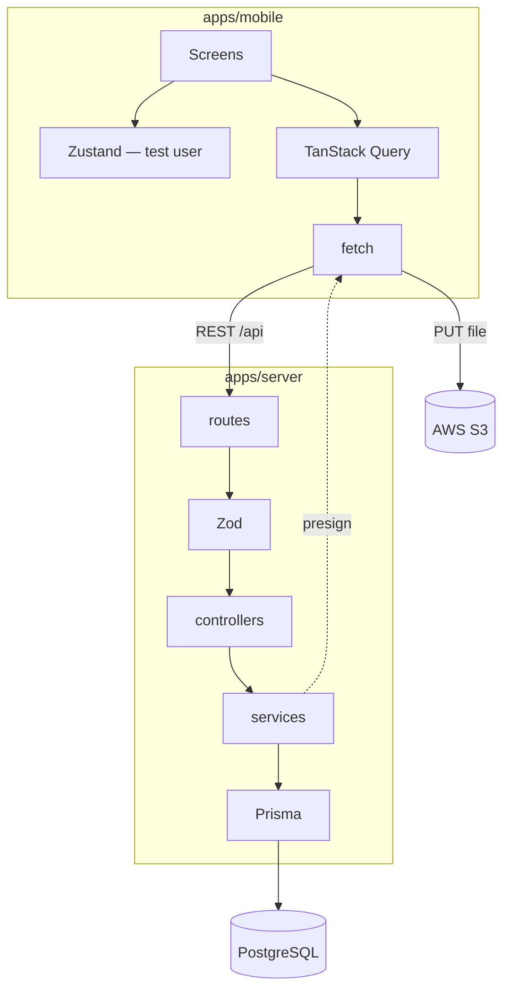
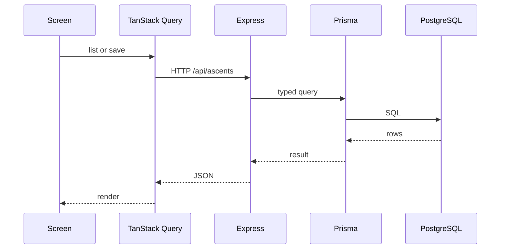
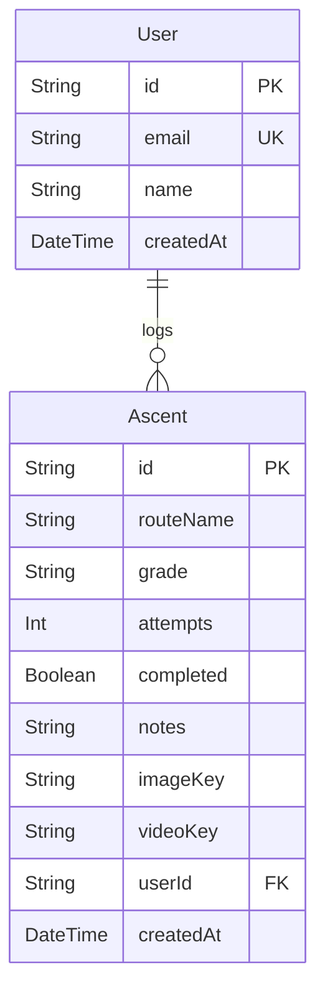
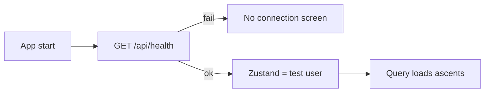
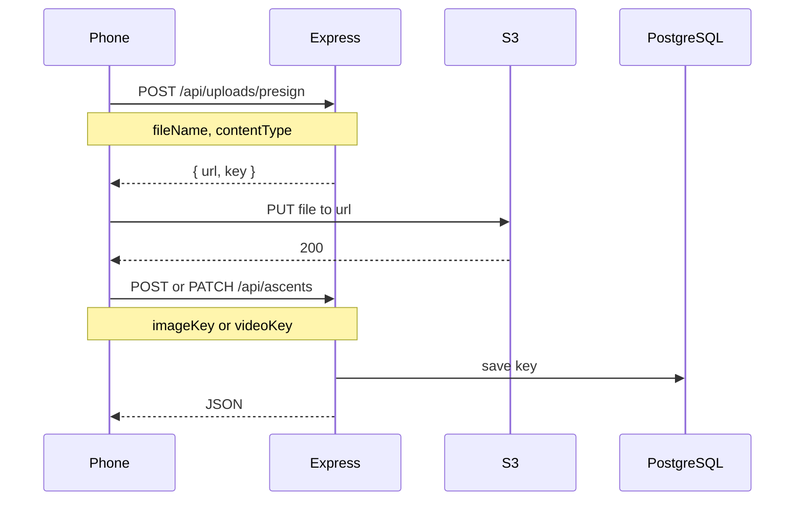

# Architecture

Official how-the-system-works doc. Product freeze: `REQUIREMENTS.md`. Build order: `ROADMAP.md` and `roadmap/`. Current files on disk: `documents/original/boilerplate.md`.

## 1. Stack (decisions)

Use these. Do not add the deferred list until a later roadmap slice.

| Area | Choice | Job |
|------|--------|-----|
| Mobile | React Native (Expo) | App UI |
| Server state | TanStack Query | Fetch, cache, loading/error |
| Session | Zustand | Test user in memory |
| HTTP | `fetch` | Talk to Express |
| API | Node.js + Express | REST |
| Validation | Zod | Request bodies |
| DB | PostgreSQL + Prisma | Users and ascents |
| Media bytes | AWS S3 | Photos now, videos later |
| Tests | Vitest + RNTL | API and UI |
| Lint | ESLint | Code quality |

**Deferred:** MongoDB, SWR, React Context for auth, Sentry, Reactotron, AsyncStorage, real login.

**Offline (early):** no cache. If `GET /api/health` (or the list fetch) fails, show a no-connection screen.

## 2. Folder tree (target / end state)

This is what the repo should look like when the app is built out. **It is not the tree today.** Today: `documents/original/boilerplate.md`.

```
bouldering-app/
├── apps/
│   ├── mobile/
│   │   ├── app/                    # Expo Router (tabs + ascent/[id])
│   │   ├── src/
│   │   │   ├── api/
│   │   │   ├── components/
│   │   │   ├── hooks/
│   │   │   ├── store/
│   │   │   ├── types/
│   │   │   └── utils/
│   │   ├── __tests__/
│   │   └── package.json
│   └── server/
│       ├── prisma/
│       │   ├── migrations/
│       │   ├── schema.prisma
│       │   └── seed.ts
│       ├── src/
│       │   ├── config/
│       │   ├── controllers/
│       │   ├── middleware/
│       │   ├── routes/
│       │   ├── services/
│       │   ├── validations/
│       │   └── index.ts
│       ├── tests/
│       └── package.json
├── package.json
└── README.md
```

## 3. System shape

Two apps. JSON goes to Postgres. Media bytes go to S3. Session is a seeded test user in Zustand — not login.



JSON CRUD (no file in this path):



Media is a separate step. See §6. JSON CRUD never carries file bytes. The phone PUTs the file to S3 after a presigned URL.

## 4. Database

Source of truth: `apps/server/prisma/schema.prisma`.

**Test user (seed):**

| Field | Value |
|-------|--------|
| `id` | `00000000-0000-4000-8000-000000000001` |
| `email` | `test@bouldering.app` |
| `name` | `Test Climber` |

All ascent CRUD uses this `userId`. No password. Seed: `npm run db:seed` in `apps/server`.

**Ascent** is one log entry. Extra columns are small and nullable so video can land later without a new table.



- `imageKey` / `videoKey`: S3 object keys, not URLs you must keep forever. Null until that media exists.
- Stats (logged count, send rate, this week) are computed on the phone from `GET /api/ascents`.

## 5. State

| Tool | Holds | Now |
|------|--------|-----|
| Zustand | Test user for this session | Set once at boot from seed / `GET /api/users/test` |
| TanStack Query | Server data | Ascents (and health) |



Do not keep the user list as the way to “log in.” Do not put ascent arrays in Zustand.

## 6. API and S3

### Endpoints

**Built**

| Method | Path | Job |
|--------|------|-----|
| `GET` | `/api/health` | Liveness |
| `GET` | `/api/users` | List (dev only) |
| `POST` | `/api/users` | Create (dev only) |

**Next**

| Method | Path | Job |
|--------|------|-----|
| `GET` | `/api/users/test` | Seeded test user |
| `GET` | `/api/ascents` | List for test user |
| `POST` | `/api/ascents` | Create |
| `GET` | `/api/ascents/:id` | One |
| `PATCH` | `/api/ascents/:id` | Update |
| `DELETE` | `/api/ascents/:id` | Delete |
| `POST` | `/api/uploads/presign` | Short-lived S3 PUT URL |

### Upload: phone → S3 (presigned)

**Postgres stores keys. S3 stores bytes.** Express never receives the file. The same helper is reused for video later (`contentType` + `videoKey`).



1. Phone calls `POST /api/uploads/presign`.
2. Express returns a short-lived `url` and object `key`.
3. Phone PUTs the file to S3 (not to Express).
4. Phone creates or updates the ascent with `imageKey` or `videoKey`.
5. Until that step, JSON CRUD can leave those fields `null`.

Need: AWS credentials on the server, a private bucket, CORS that allows the phone origin, a tight presign (time-limited, one key, one content type). Do not make the bucket public.
