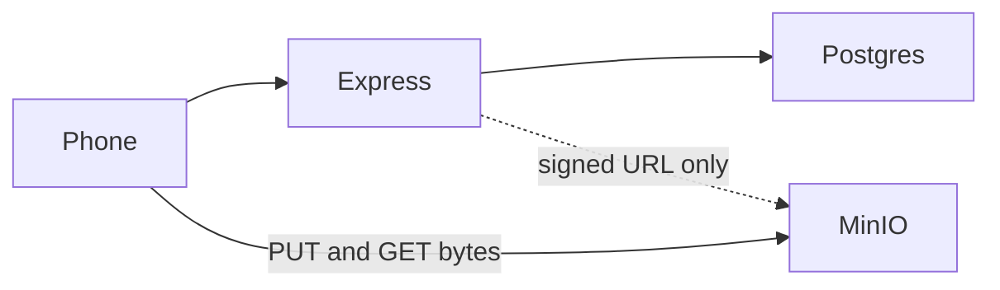
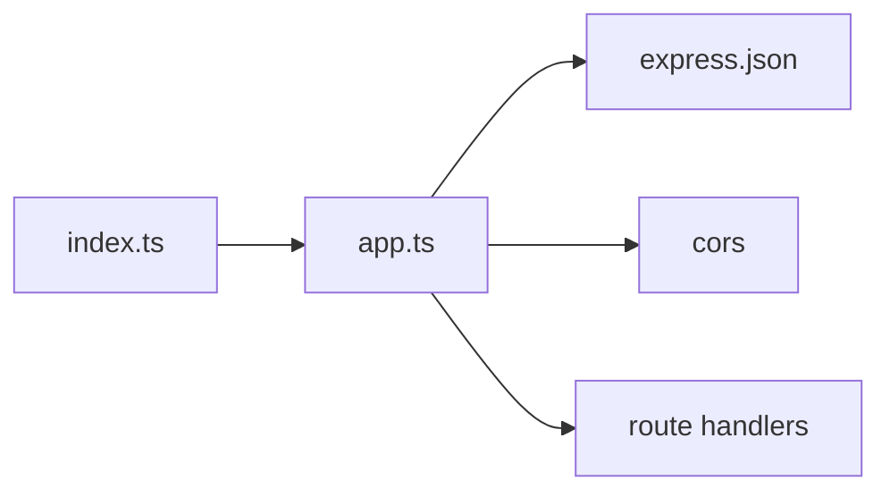
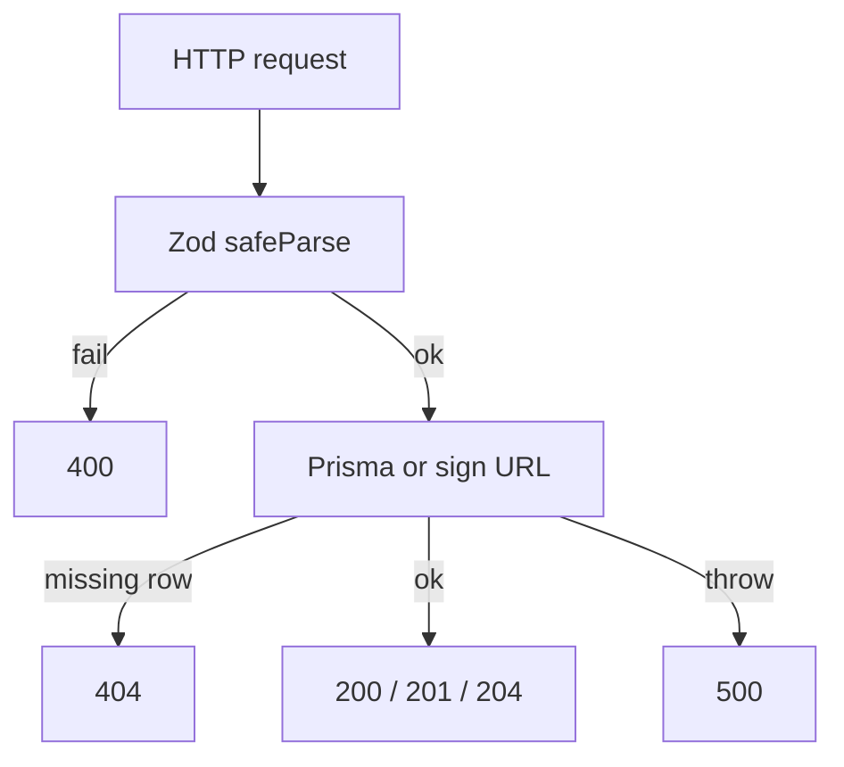
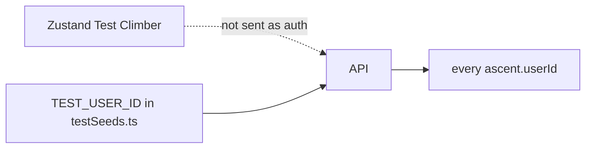
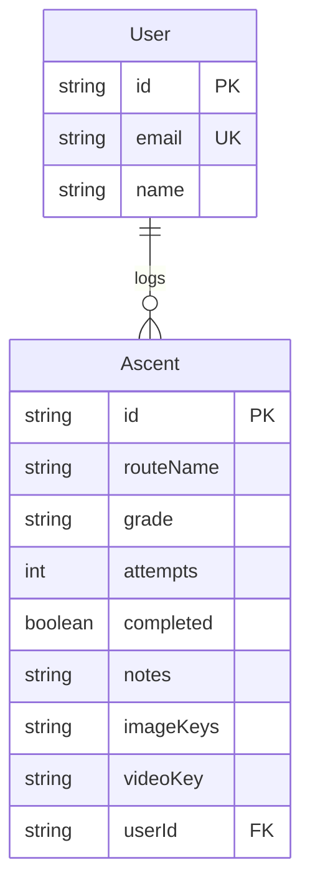
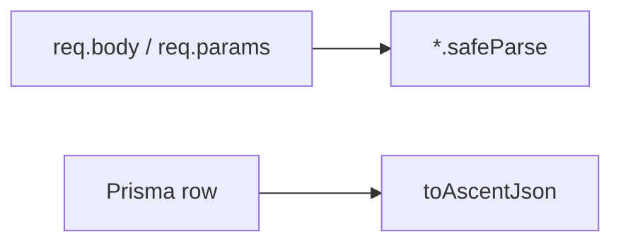
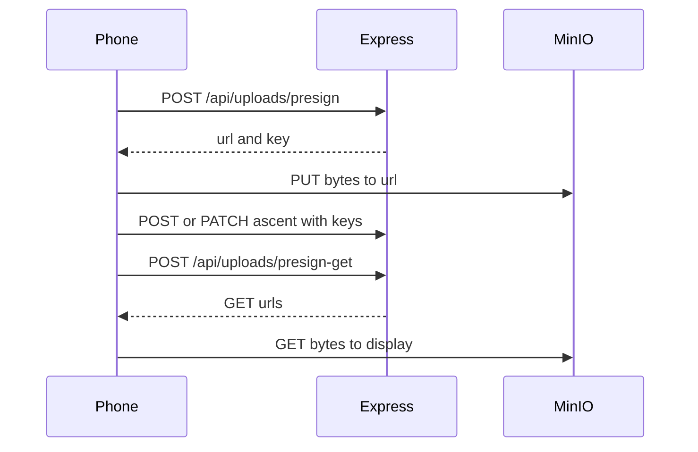
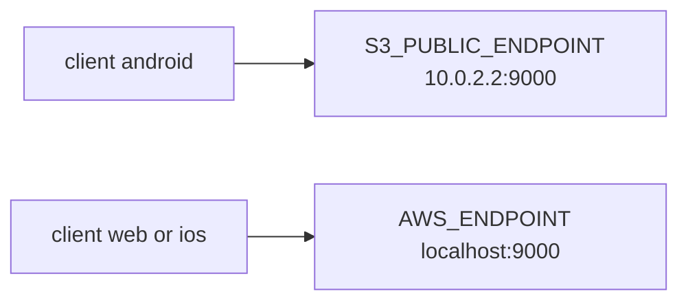
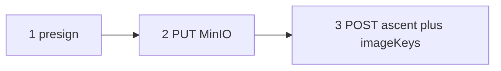
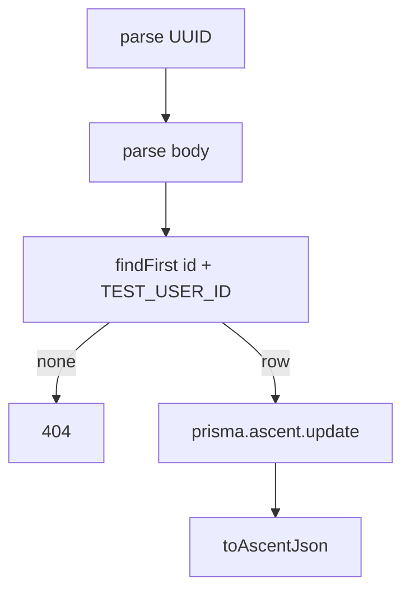

# Backend

How the Express API is put together. The phone never opens PostgreSQL or MinIO with admin keys. **Express is the only process that holds database and S3 credentials.**

Product freeze: [`REQUIREMENTS.md`](REQUIREMENTS.md). Libraries: [`STACK.md`](STACK.md). Phone UI: [`FRONTEND.md`](FRONTEND.md). How to run: [`DEVELOPMENT.md`](DEVELOPMENT.md).

There are no separate `controllers/` or `routes/` folders. Almost every HTTP handler lives in **one file**: `apps/server/src/app.ts`. That is on purpose for this course size.

Diagrams are small and one direction so Mermaid stays readable.

---

## 1. What Express is for



| Job | Who does it |
|-----|-------------|
| JSON CRUD for climbs | Express + Prisma + Postgres |
| Mint short-lived upload/download URLs | Express + AWS SDK |
| Store photo/video **bytes** | MinIO (phone talks to it directly) |
| Store photo/video **keys** | Postgres on the `Ascent` row |
| Show “who is logged in” | Not Express. Zustand on the phone is display-only |

**Hard rule:** file bytes never enter Express. A `POST /api/ascents` body can include `imageKeys` and `videoKey` (strings). It cannot include a JPEG.

---

## 2. Folder map

```
apps/server/
├── src/
│   ├── index.ts              # listen on PORT (4000)
│   ├── app.ts                # middleware + every route
│   ├── config/testSeeds.ts   # fixed Test Climber ids
│   ├── lib/
│   │   ├── prisma.ts         # Prisma client + DATABASE_URL
│   │   ├── s3.ts             # MinIO client + which host to sign
│   │   └── presign.ts        # PUT/GET signed URLs + object keys
│   ├── validations/
│   │   ├── ascent.ts         # Zod for climb JSON
│   │   ├── user.ts           # Zod for GET /api/users/test
│   │   └── upload.ts         # Zod for presign bodies
│   └── generated/prisma/     # Prisma Client (do not edit by hand)
├── prisma/
│   ├── schema.prisma
│   ├── seed.ts
│   └── migrations/
├── prisma.config.ts          # Prisma 7: schema path + DATABASE_URL
├── tests/                    # Vitest + Supertest
└── .env                      # gitignored
```

`index.ts` only calls `app.listen`. Tests import `app` and never listen on a port.

---

## 3. Boot



1. `tsx watch src/index.ts` loads TypeScript.
2. Importing `app.ts` also imports `prisma.ts`, which loads `.env` (`dotenv`).
3. Middleware: `cors()` (so Expo **web** can call `:4000`), then `express.json()` (parse JSON bodies).
4. Listen on `process.env.PORT` or **4000**.

If Postgres is down, health still returns 200 (health does not touch the database). Climb routes return 500.

---

## 4. Request pipeline (every JSON route)

Same shape. Presign skips Prisma and talks to the AWS SDK instead.



| Status | Meaning in this API |
|--------|---------------------|
| 200 | Success with a JSON body |
| 201 | Created an ascent or (legacy) user |
| 204 | Deleted. **Empty body** |
| 400 | Bad UUID, empty PATCH, bad presign MIME, bad key prefix |
| 404 | Test user or ascent not found |
| 500 | Prisma/S3/env failure |

`toAscentJson` / `toTestUserJson` run Zod on the **outbound** object so dates become ISO strings and the phone always sees the same shape.

---

## 5. There is no login



`apps/server/src/config/testSeeds.ts` fixes:

| Constant | Value |
|----------|--------|
| `TEST_USER_ID` | `00000000-0000-4000-8000-000000000001` |
| `TEST_USER_EMAIL` | `test@bouldering.app` |
| `TEST_USER_NAME` | Test Climber |
| `TEST_ASCENT_ID` | `…00011` (seed climb “Orange Overhang”) |
| `UNKNOWN_ASCENT_ID` | `…00099` (tests expect 404) |

List/create/get/patch/delete **ignore** whatever the phone thinks the user is. `POST /api/ascents` always sets `userId: TEST_USER_ID`. Get/patch/delete use `findFirst({ id, userId: TEST_USER_ID })` so another user’s row would 404.

JWT stays out of this project. Replacing the constant with a token id is the later-course story, not this code.

---

## 6. Data model (what Postgres stores)

Source: `prisma/schema.prisma`. One user has many ascents.



`imageKeys` is a **string array** (Postgres `text[]`). `videoKey` is one optional string. These are **object keys** such as `ascents/<userId>/<uuid>-climb.jpg`, not URLs.

Stats (send rate, this week) are **not** API routes. Home computes them from `GET /api/ascents`.

Seed (`prisma/seed.ts`, `npm run db:seed` in `apps/server`): upsert Test Climber and the Orange Overhang row. Safe to run more than once.

Prisma 7: `prisma.config.ts` points at `DATABASE_URL`. Runtime uses `@prisma/adapter-pg` + `pg` in `lib/prisma.ts`. Generated client is `src/generated/prisma`.

---

## 7. Route catalog

Order in `app.ts` matters: `/api/users/test` is registered **before** any `/api/users/:id` (there is no `:id` user route today). `/api/ascents/:id` is after the collection routes.

### Health and test user

| Method | Path | Prisma? | Job |
|--------|------|---------|-----|
| `GET` | `/api/health` | No | `{ status: "ok", message }` so the phone can show “No connection” |
| `GET` | `/api/users/test` | Yes | Seeded climber JSON, or 404 if you forgot seed |

### Ascents (the product)

| Method | Path | Job |
|--------|------|-----|
| `GET` | `/api/ascents` | All logs for `TEST_USER_ID`, newest first |
| `POST` | `/api/ascents` | Create. Client does **not** send `userId` |
| `GET` | `/api/ascents/:id` | One log if it belongs to the test user |
| `PATCH` | `/api/ascents/:id` | Partial update. Body must have **at least one** field |
| `DELETE` | `/api/ascents/:id` | Delete. 204 |

`:id` must be a UUID (Zod). Junk strings → 400 before Prisma.

Create/update body (Zod): `routeName`, `grade` required on create; `attempts`, `completed`, `notes`, `imageKeys`, `videoKey` optional. PATCH is that object **partial**, but `{}` is rejected.

**`imageKeys` is a replace, not a merge.** Whatever array the client sends is what Prisma writes. The phone concatenates old + new keys, then PATCHes the full list.

### Uploads (sign only)

| Method | Path | Job |
|--------|------|-----|
| `POST` | `/api/uploads/presign` | Signed **PUT** `{ url, key, contentType }` |
| `POST` | `/api/uploads/presign-get` | Signed **GET** `{ items: [{ key, url }] }` (1–20 keys) |

### Leftover demo routes (not used by the Expo app)

| Method | Path | Job |
|--------|------|-----|
| `GET` | `/api/users` | Raw Prisma users (no Zod wrapper) |
| `POST` | `/api/users` | Create any email/name — **not** the test-user flow |

Keep them for old tests (`tests/api.test.ts`). Do not build the diary on them.

---

## 8. Zod files



| File | Guards |
|------|--------|
| `validations/ascent.ts` | UUID param; create/update body; list/one response |
| `validations/user.ts` | Test user response must be the seed id/email |
| `validations/upload.ts` | MIME allow-list; optional `client`; get-keys length |

Allowed `contentType` values:

- Images: `image/jpeg`, `image/png`, `image/webp`, `image/gif`
- Video: `video/mp4`, `video/quicktime`, `video/webm`

Anything else → 400 `Invalid presign body`.

---

## 9. Presign (the media path)

Postgres never stores the file. Express never sees the file. Express **signs** a URL that already includes the bucket, key, content type, and expiry.



### PUT (`createPresignedPut`)

1. Sanitize the file name (no path tricks).
2. Key: `ascents/<TEST_USER_ID>/<uuid>-<safeName>`.
3. Sign `PutObject` with matching `ContentType`.
4. Expiry: **300s** for images, **900s** for `video/*`.

The phone must PUT with the **same** `Content-Type` header or MinIO rejects the signature.

### GET (`createPresignedGet`)

1. Key must start with `ascents/<TEST_USER_ID>/` and must not contain `..`.
2. Otherwise 400 `Invalid object key` (does not sign other users’ prefixes).
3. Expiry: **3600s**.

Express does **not** check that the key is already saved on an ascent row. Ownership is “prefix + later PATCH from this test user’s climbs.”

### Which host is inside the URL

The AWS signature includes the **Host** header. The phone/browser must call that same host.



`lib/s3.ts`: `createS3Client(client)` uses `S3_PUBLIC_ENDPOINT` only when `client === 'android'` and that env var is set. Web/iOS use `AWS_ENDPOINT`.

Other SDK details that matter:

- `forcePathStyle: true` — MinIO wants `/bucket/key`, not `bucket.localhost`.
- Checksums `WHEN_REQUIRED` — extra checksum query params would break a simple PUT from `fetch`.

MinIO credentials stay on the server (`AWS_ACCESS_KEY_ID` / `AWS_SECRET_ACCESS_KEY`, usually `minioadmin` locally).

---

## 10. One climb, two round trips

Create with a photo is not one HTTP call.



Edit is the same with PATCH. Delete removes the **row**. It does **not** delete objects in MinIO (MVP).

---

## 11. How a handler is wired (example: PATCH)



Create skips `findFirst` and always stamps `userId`. List is `findMany` + `orderBy createdAt desc`. Delete is find, then `delete`, then `204`.

---

## 12. Tests

Vitest + Supertest import `app` (and sometimes `prisma` to clean up rows).

| File | Covers |
|------|--------|
| `tests/api.test.ts` | Health + leftover POST `/api/users` 400 |
| `tests/users-test.test.ts` | GET `/api/users/test` |
| `tests/ascents-list.test.ts` | GET list includes seed climb |
| `tests/ascents-get.test.ts` | GET one |
| `tests/ascents-post.test.ts` | POST create |
| `tests/ascents-patch.test.ts` | PATCH fields, `imageKeys`, `videoKey`, empty body, 404 |
| `tests/ascents-delete.test.ts` | DELETE 204 |
| `tests/uploads-presign.test.ts` | PUT sign + MIME + android vs web host |
| `tests/uploads-presign-get.test.ts` | GET sign + rejected foreign prefix |

Presign tests **sign** URLs. They need MinIO env vars. They do not upload a real file.

Root scripts: `npm run test:ascents-list`, `test:uploads-presign`, and so on.

---

## 13. Env vars the API actually reads

| Variable | Used for |
|----------|----------|
| `DATABASE_URL` | Prisma |
| `PORT` | Listen (default 4000) |
| `AWS_REGION` | S3 client (default `us-east-1`) |
| `AWS_ACCESS_KEY_ID` / `AWS_SECRET_ACCESS_KEY` | MinIO user |
| `AWS_ENDPOINT` | Sign for web/iOS (`http://localhost:9000`) |
| `S3_PUBLIC_ENDPOINT` | Sign for Android emulator (`http://10.0.2.2:9000`) |
| `S3_BUCKET` | Bucket name (`bouldering`) |

`.env` is gitignored. Copy from [`DEVELOPMENT.md`](DEVELOPMENT.md).

---

## 14. What the backend does not do

- Passwords, JWT, sessions, or reading Zustand
- Multipart file upload
- Image resizing or video transcoding
- Deleting MinIO objects when a climb is deleted
- A `/api/stats` route
- Checking that a presigned GET key is already on an ascent
- CORS configuration **on the MinIO bucket** via this codebase (community MinIO has no `PutBucketCors` UI; web PUT still needs MinIO to allow the browser origin)

---

## 15. Six sentences to remember

1. **`app.ts` is the API.** Zod in, Prisma or presigner in the middle, JSON out.
2. **Every climb belongs to `TEST_USER_ID`.** The phone cannot pick another user.
3. **Keys in Postgres, bytes in MinIO.** Express only signs URLs.
4. **PATCH `imageKeys` replaces the whole array.** The client sends the full list.
5. **Signed URL host must match the device** (`localhost` vs `10.0.2.2`).
6. **Health does not prove Postgres.** Seed + climb routes do.

If something is wrong, it is usually **Zod 400**, **wrong user id / 404**, **env / Prisma 500**, or **presign host / Content-Type** on the PUT to port 9000.
