# Frontend

How the Expo app is put together. **Boulder Logs** is a phone diary for indoor bouldering. One codebase runs on web, Android emulator, and (in principle) iOS Simulator.

Product freeze: [`REQUIREMENTS.md`](REQUIREMENTS.md). Why each library exists: [`STACK.md`](STACK.md). API: [`BACKEND.md`](BACKEND.md). System shape: [`ARCHITECTURE.md`](ARCHITECTURE.md). How to run: [`DEVELOPMENT.md`](DEVELOPMENT.md).

The phone never talks to Postgres or MinIO “as a database.” JSON goes to **Express**. File bytes go to **signed MinIO URLs**.

Diagrams below are small on purpose. Mermaid draws nested boxes poorly when arrows skip between groups, so each picture is one idea, one direction.

---


## 1. Four layers

Read top to bottom. A screen should not skip the layer under it unless it has a good reason (Profile talks to Zustand; Home talks to Query).

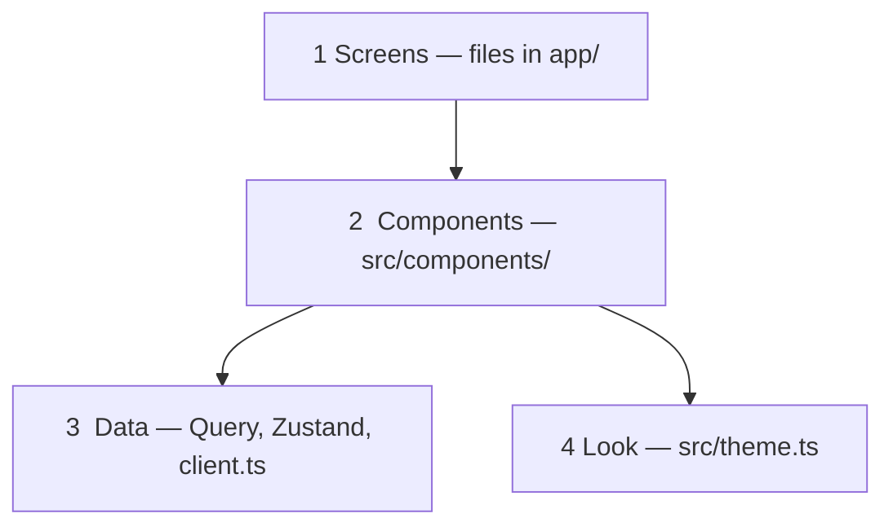


| Layer          | Job                                                       |
| -------------- | --------------------------------------------------------- |
| **Screens**    | A file is a page. Expo Router maps folders to URLs.       |
| **Components** | Shared form, buttons, cards.                              |
| **Data**       | Fetch lists, remember the test climber, know the API URL. |
| **Look**       | Colors, spacing, type size.                               |


Who talks to whom (still one direction, left to right):

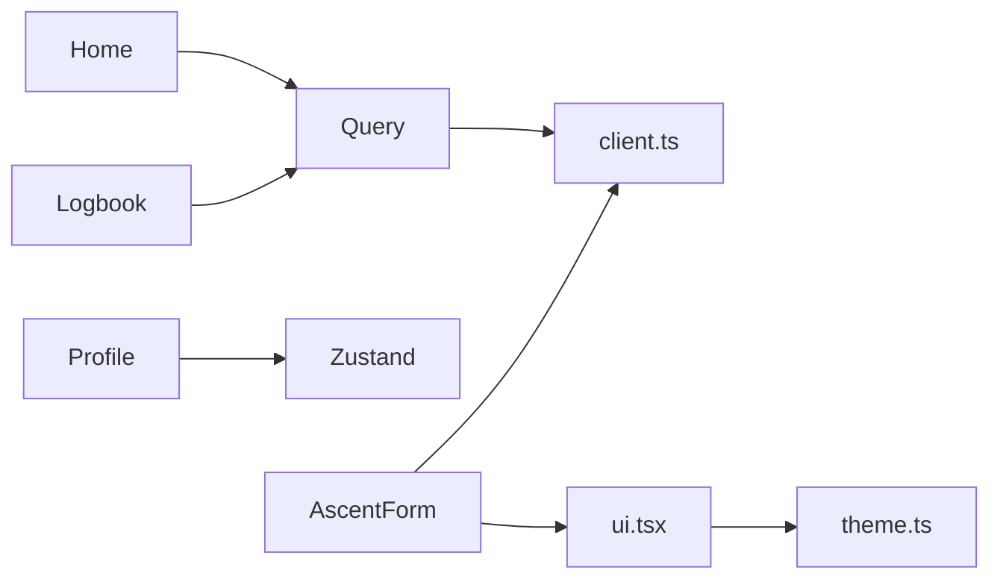


**Rule of thumb:** screens decide *when* to load and *where* to go. Components decide *how it looks*. `client.ts` decides *how HTTP works*.

`AscentForm` does **not** use Zustand. Only Profile (and the root layout that fills the store) do.

---


## 2. Folder map

```
apps/mobile/
├── app/                         # pages and layouts
│   ├── _layout.tsx              # providers, health check, stack
│   ├── (tabs)/
│   │   ├── _layout.tsx          # bottom tabs
│   │   ├── index.tsx            # Home  →  /
│   │   ├── Logbook.tsx
│   │   └── Profile.tsx
│   └── ascent/
│       ├── new.tsx              # create
│       └── [id].tsx             # edit / delete
├── src/
│   ├── api/client.ts
│   ├── components/
│   │   ├── ui.tsx
│   │   ├── AscentForm.tsx
│   │   └── AscentVideoPlayer.tsx
│   ├── store/useAuthStore.ts
│   └── theme.ts
└── package.json                 # main: expo-router/entry
```

`(tabs)` is a **group**, not a URL piece. You open `/Logbook`, not `/(tabs)/Logbook`. `_layout.tsx` files are not pages.

---


## 3. Navigation

The root is a **stack** (push a page, Back pops it). The first stack page is the **tab bar**. Create and edit sit on top of the tabs, so the bottom bar hides while you fill in a climb.

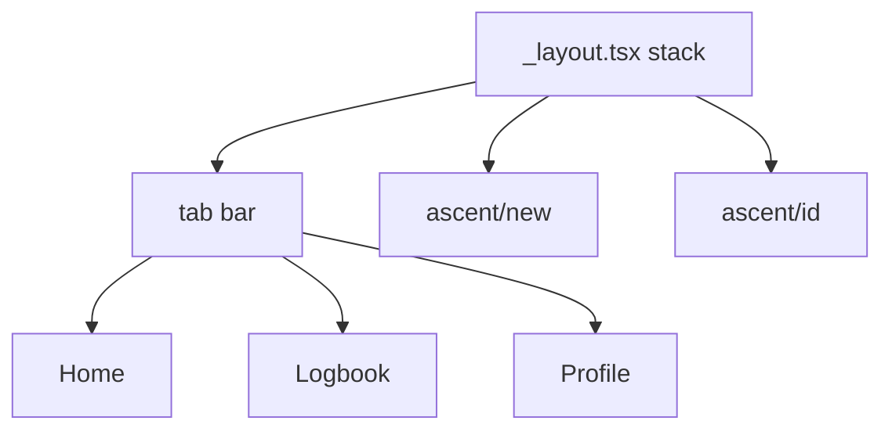


How you move:

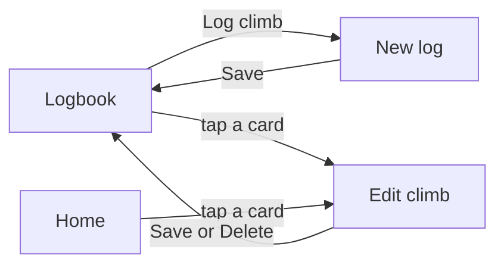


| File                 | Route         | Kind  | Header  |
| -------------------- | ------------- | ----- | ------- |
| `(tabs)/index.tsx`   | `/`           | Tab   | Hidden  |
| `(tabs)/Logbook.tsx` | `/Logbook`    | Tab   | Hidden  |
| `(tabs)/Profile.tsx` | `/Profile`    | Tab   | Hidden  |
| `ascent/new.tsx`     | `/ascent/new` | Stack | New log |
| `ascent/[id].tsx`    | `/ascent/…`   | Stack | Climb   |


Code: `router.push('/ascent/new')`, `router.push(\`/ascent/${id})`,` router.back()` after a successful save.

---


## 4. Boot (before any tab)

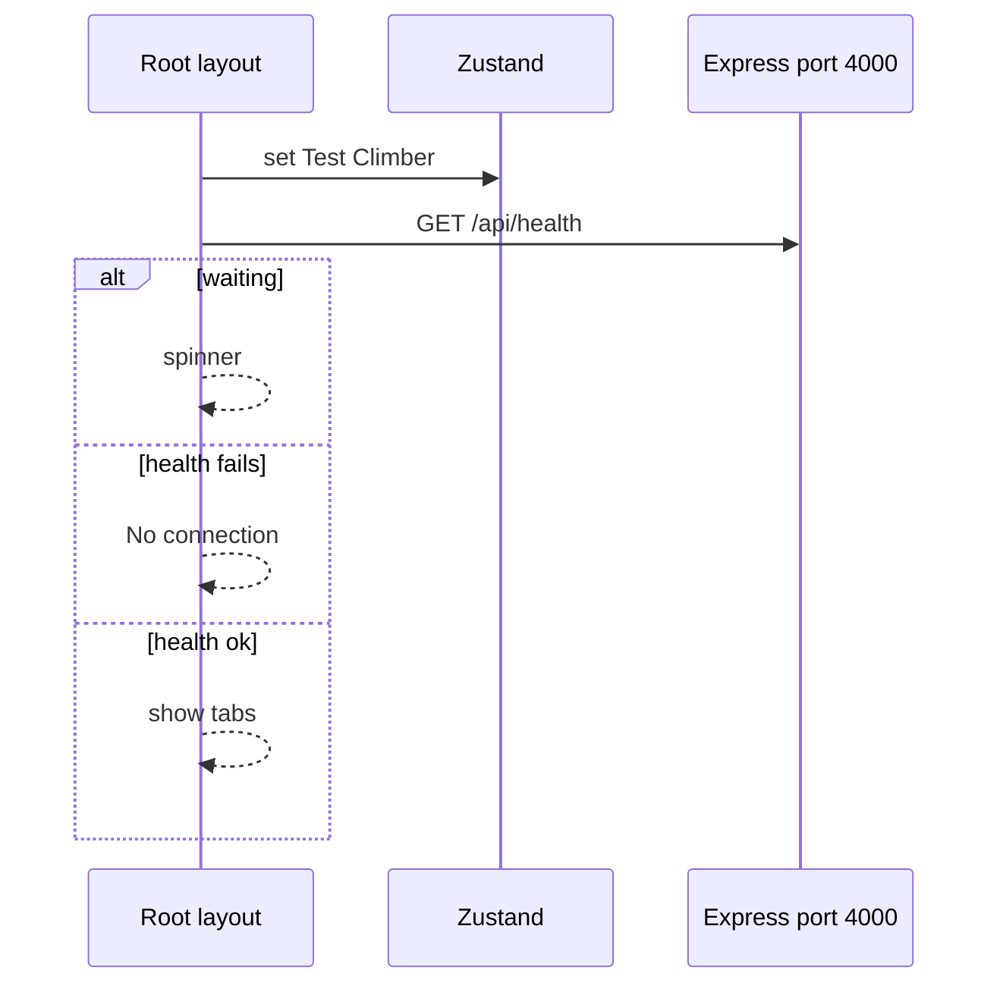


Around that:

1. **SafeAreaProvider** — keep content off the notch.
2. **QueryClientProvider** — one TanStack Query cache for the whole app.
3. **Zustand** — hardcoded Test Climber (same id/email as the seed). Display only. Express still uses its own `TEST_USER_ID`. No token.
4. **Health** — if Express is down, a full-screen “No connection” and **no tabs**. No offline cache.

---


## 5. Two kinds of state

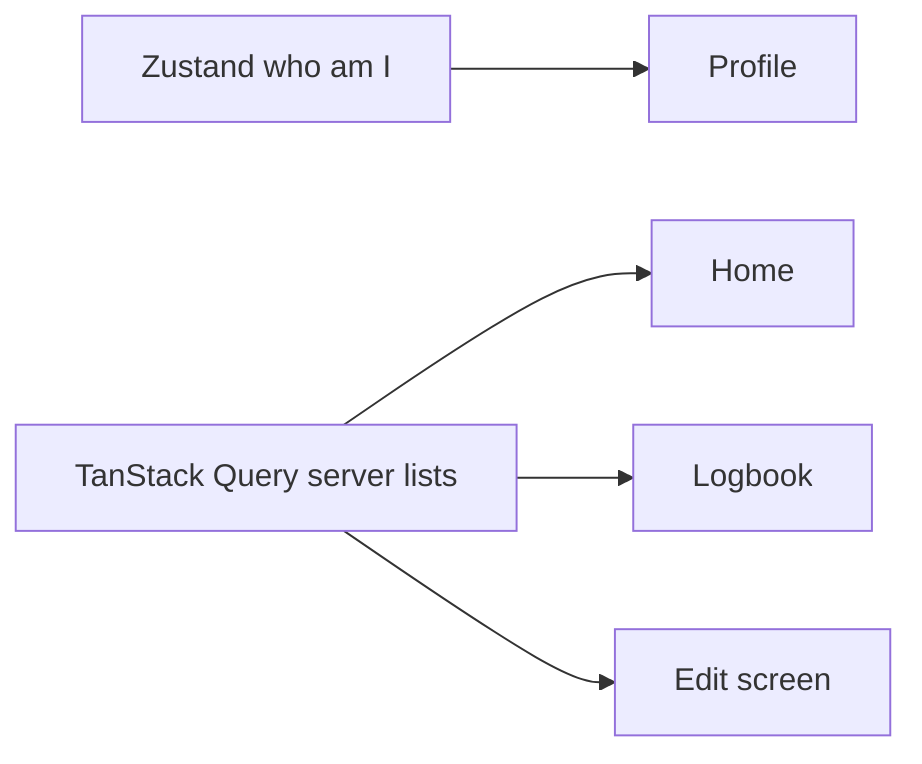


|                 | Zustand                    | TanStack Query                 |
| --------------- | -------------------------- | ------------------------------ |
| Holds           | Test Climber name/email    | Climb list, one climb, health  |
| Lives           | RAM for this process       | RAM cache, keyed by `queryKey` |
| Survives reload | No                         | No                             |
| Truth           | Hardcoded in `_layout.tsx` | PostgreSQL via Express         |


Home and Logbook share `queryKey: ['ascents']`. Invalidate that key after Save and both tabs can refresh.

They also set `staleTime: 0` and refetch when the screen is focused (`useFocusEffect`), so `router.back()` does not show a stale list.

---


## 6. `client.ts` — the only HTTP file

Screens call named helpers. Almost nothing else calls `fetch`.

### Where is Express?

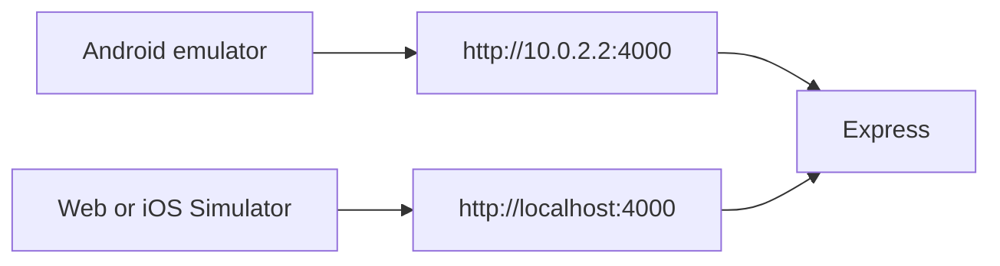


`10.0.2.2` is the emulator’s name for **your laptop**. `localhost` inside the emulator would be the emulator itself.

Presign bodies also send `client: 'android' | 'web' | 'ios'` so the signed MinIO URL uses a host that device can reach (`10.0.2.2:9000` vs `localhost:9000`). The signature includes the Host header, so the URL host must match.

### Helpers


| Helper           | HTTP                            | Used by       |
| ---------------- | ------------------------------- | ------------- |
| `fetchHealth`    | `GET /api/health`               | Root layout   |
| `fetchAscents`   | `GET /api/ascents`              | Home, Logbook |
| `fetchAscent`    | `GET /api/ascents/:id`          | Edit          |
| `createAscent`   | `POST /api/ascents`             | New log       |
| `updateAscent`   | `PATCH /api/ascents/:id`        | Edit          |
| `deleteAscent`   | `DELETE /api/ascents/:id`       | Edit          |
| `presignUpload`  | `POST /api/uploads/presign`     | Form pick     |
| `putToSignedUrl` | `PUT` to MinIO                  | Form bytes    |
| `presignGets`    | `POST /api/uploads/presign-get` | Form preview  |


- `Ascent` — API response (`id`, `imageKeys`, `videoKey`, `createdAt`, …).
- `AscentWrite` — create/update body (no `id`).

---


## 7. Each screen


### Home

No `/api/stats` route. Stats are computed from the same list as Logbook.

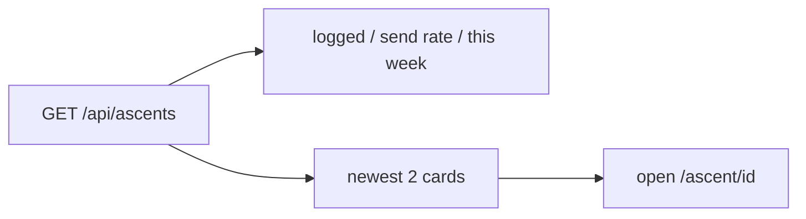


Loading → `LoadingBlock`. Error or empty → `EmptyState`.

### Logbook

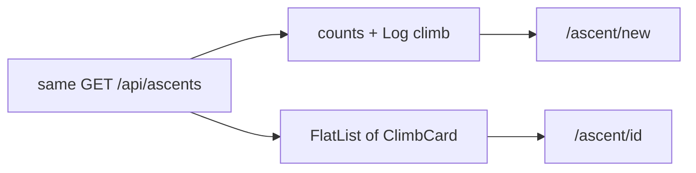


### Profile

Reads Zustand. No fetch. Copy says this is a test session, not login.

### New log

Thin wrapper: `ScrollView` + `AscentForm` with no `initial` and no Delete.

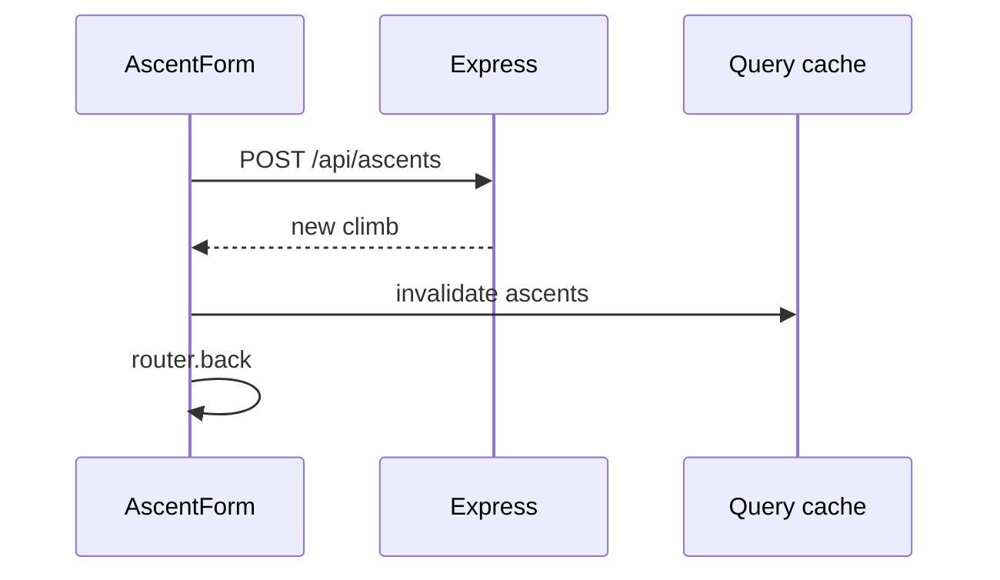


`busy` / `error` on the form come from the mutation, not from photo upload.

### Edit climb

1. Read `id` from the URL.
2. Load `GET /api/ascents/:id` → `initial={data}`.
3. Save → `PATCH`. Delete → `DELETE`. Then invalidate and go back.

Missing id, loading, and load-error each render before the form mounts.

---


## 8. Shared UI (`ui.tsx`)

All of these read `theme.ts`.

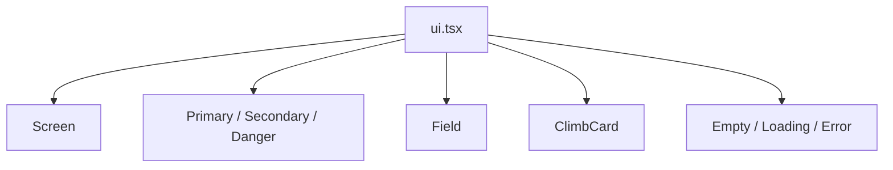


| Piece                                                | Job                                                                                    |
| ---------------------------------------------------- | -------------------------------------------------------------------------------------- |
| `Screen`                                             | Safe area + chalk background (tabs).                                                   |
| `Card`                                               | Profile panel.                                                                         |
| `PrimaryButton`                                      | Save, Log climb.                                                                       |
| `SecondaryButton`                                    | Pick photos / video.                                                                   |
| `DangerButton`                                       | Delete.                                                                                |
| `Field`                                              | Label + text input.                                                                    |
| `ClimbCard`                                          | Name, grade, SEND/project, attempts, “photo” / “clip”, date, notes. **No thumbnails.** |
| `EmptyState` / `LoadingBlock` / `ErrorText` / `Hint` | Feedback.                                                                              |


List rows only have **keys**, not URLs. Signed GET URLs are fetched on the **detail form**. The card only says that media exists.

---


## 9. Theme (`theme.ts`)


| Token                    | Role                     |
| ------------------------ | ------------------------ |
| `bg`                     | Page chalk `#F4EFE6`     |
| `surface`                | Cards, tab bar           |
| `ink` / `muted` / `line` | Text and borders         |
| `primary`                | Actions, active tab      |
| `sendBg` / `projectBg`   | SEND vs still projecting |
| `danger` / `dangerBg`    | Delete and errors        |


---


## 10. `AscentForm` — create and edit share one form

The screen only decides **which API call**. The form owns fields, pickers, and preview.

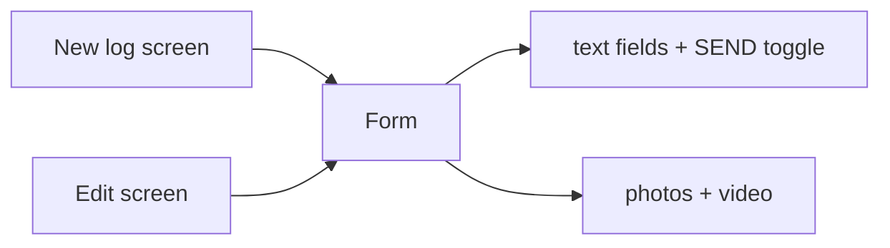


| Prop             | Create          | Edit             |
| ---------------- | --------------- | ---------------- |
| `initial`        | omitted         | loaded climb     |
| `onSubmit`       | `POST`          | `PATCH`          |
| `onDelete`       | omitted         | `DELETE`         |
| `busy` / `error` | create mutation | update or delete |


Typing stays in React `useState` until Save. **Picking a file uploads bytes to MinIO immediately.** Save only attaches **keys** to the row.

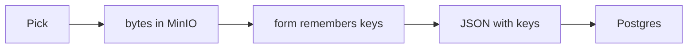


If you pick and leave without Save, an unused object can sit in MinIO. This MVP does not delete it.

Save payload:

- `imageKeys` = old keys + keys from this visit (full array).
- `videoKey` is sent **only if** the user picked a new clip this visit.
- Attempts: string in the box, parsed to a number (`NaN` → `0`).

---


## 11. Photos and video

Postgres stores **object keys**. URLs expire. Keys do not.

Allowed: JPEG, PNG, WebP, GIF; video MP4, QuickTime (`mov`), WebM. Aliases: `image/jpg` → `image/jpeg`, `video/x-quicktime` → `video/quicktime`.

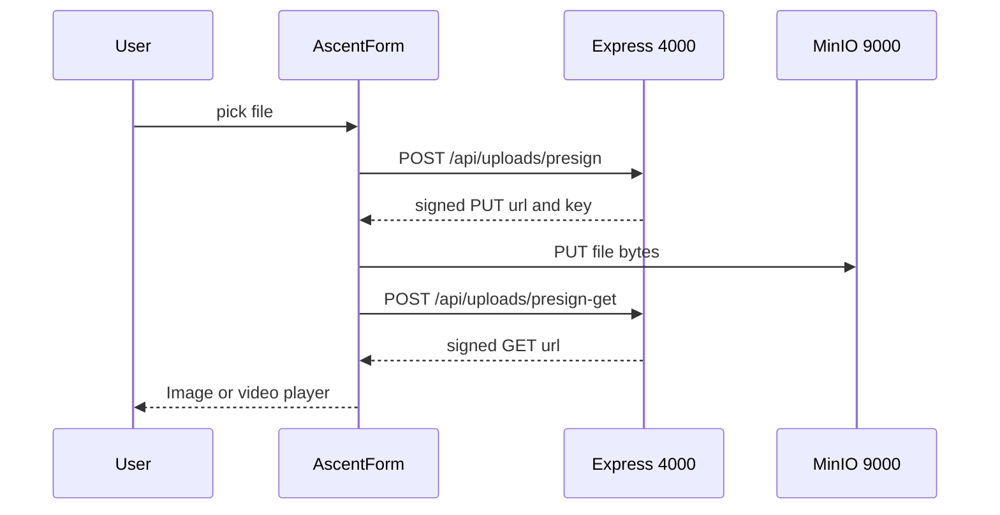


In DevTools: JSON to **:4000**, then PUT to **:9000**. A PUT to :4000 means the signed URL is wrong.

On web, pick must run from a **button press**. Prefer `asset.file`; otherwise fetch `asset.uri` as a blob.

`AscentVideoPlayer` (`expo-video`) takes the signed GET URI. The form remounts it with `key={videoUrl}` when the URL changes.

---


## 12. One full walk: log a send with a photo

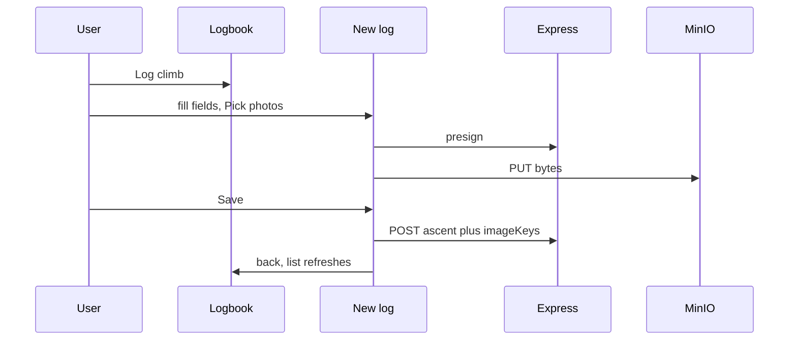


Edit is the same, except the screen loads one climb first and Save is `PATCH`.

---


## 13. After Save, lists refresh

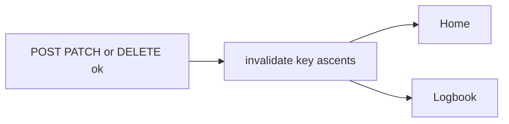


PATCH also invalidates `['ascent', id]`. Combined with focus-refetch, returning to a tab should show the new row.

---


## 14. File tree of imports

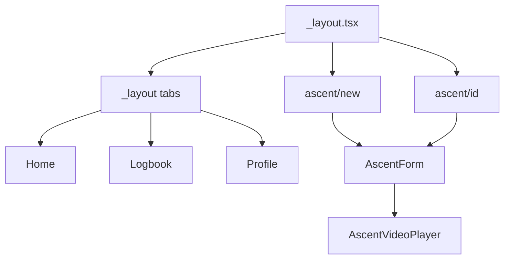


There is no `src/hooks/` folder. `useQuery` / `useMutation` live in the screen files.

---


## 15. Libraries the UI uses


| Package                             | Role                         |
| ----------------------------------- | ---------------------------- |
| `expo` + `expo-router`              | Shell and file routes        |
| `react-native` / `react-native-web` | Same screens on web          |
| `@tanstack/react-query`             | Server cache                 |
| `zustand`                           | Test user                    |
| `expo-image-picker`                 | Library pick (not recording) |
| `expo-video`                        | Beta clip                    |
| `react-native-safe-area-context`    | Notch / home bar             |
| `@expo/vector-icons`                | Tab icons                    |


Not in this frontend: JWT, login, AsyncStorage, SWR, camera recording, a stats API, list thumbnails.

---


## 16. Six sentences to remember

1. Tabs are the diary. Stack screens are “a climb in a form.”
2. Lists are Query. The name on Profile is Zustand.
3. JSON goes to Express. Bytes go to MinIO. Keys in Postgres glue them.
4. Pick uploads immediately. Save attaches keys.
5. One form, two screens. Create vs edit is props.
6. `theme.ts` + `ui.tsx` keep the demo looking like one product.

If something is wrong, it is usually **navigation**, **cache** (forgot invalidate/refetch), or **media** (presign host / PUT to the wrong port).