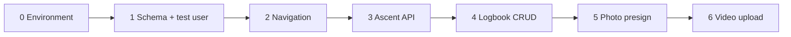

# Roadmap

One slice at a time. The index stays here. **How to do each slice** lives in `roadmap/` — one file per step, not per screen.

That is the slow path: open only the current file, install only what that file lists, stop at **Done**. Do not pre-read the next step unless you are stuck.

| Step | File |
|------|------|
| 0 | [roadmap/00-environment.md](roadmap/00-environment.md) |
| 1 | [roadmap/01-schema-test-user.md](roadmap/01-schema-test-user.md) |
| 2 | [roadmap/02-navigation.md](roadmap/02-navigation.md) |
| 3 | [roadmap/03-ascent-api.md](roadmap/03-ascent-api.md) |
| 4 | [roadmap/04-logbook-crud.md](roadmap/04-logbook-crud.md) |
| 5 | [roadmap/05-photo-upload.md](roadmap/05-photo-upload.md) |
| 6 | [roadmap/06-video-upload.md](roadmap/06-video-upload.md) |
| 7 | UI polish (no extra roadmap file) — **do this next** |

Video is in. Do not add JWT.
