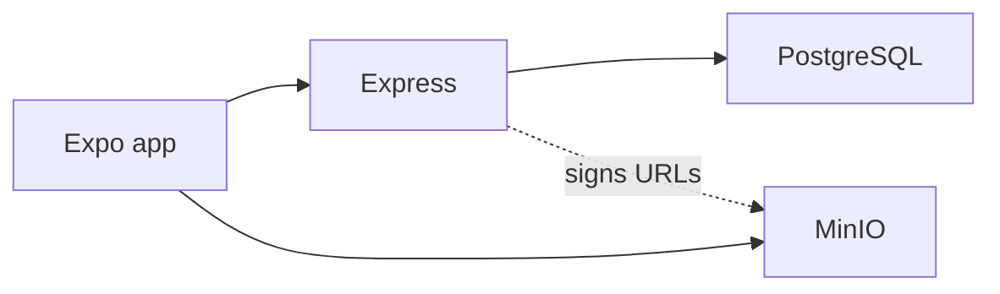
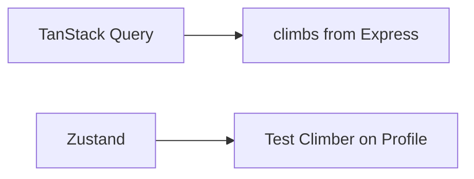

# Stack

One page: **what we installed, what pain it removes, why this project uses it.**

If you only remember “we used Zustand and TanStack Query,” start at [§3 Phone data](#3-phone-data). The rest is the same idea for the rest of the repo.

Product: [`REQUIREMENTS.md`](REQUIREMENTS.md). How screens connect: [`FRONTEND.md`](FRONTEND.md). How the API works: [`BACKEND.md`](BACKEND.md). How to run: [`DEVELOPMENT.md`](DEVELOPMENT.md).

---

## 0. Picture

Two apps in one repo. **JSON** (climbs, keys) goes Phone → Express → Postgres. **File bytes** go Phone → MinIO. Express never receives the photo file.

---

## 1. Cheatsheet

| Piece | One-line job |
|-------|----------------|
| **npm workspaces** | One `npm install` for phone + API |
| **TypeScript** | Catch shape mistakes before runtime |
| **React Native + Expo** | One UI for web and Android (and iOS) |
| **Expo Router** | Files under `app/` become screens |
| **TanStack Query** | Load / cache / refetch **server** lists |
| **Zustand** | Hold the **test climber** in RAM (not login) |
| **`fetch`** | HTTP. No Axios |
| **Express** | REST on port 4000 |
| **Zod** | Reject bad JSON before Prisma |
| **Prisma + PostgreSQL** | Users and ascents |
| **AWS SDK + MinIO** | Sign PUT/GET; store photo/video bytes |
| **expo-image-picker** | Pick an existing photo/video |
| **expo-video** | Play the beta clip |
| **Vitest + Supertest** | Hit the API in tests |
| **ESLint** | Lint from the repo root |
| **Docker** | Local Postgres + MinIO |

**Not in this project:** JWT, real login, MongoDB, SWR, Axios, AsyncStorage, Sentry, Reactotron, React Native Testing Library, in-app camera recording.

---

## 2. Repo and language

### npm workspaces

- **What:** Root `package.json` lists `apps/*`. Phone is `apps/mobile`, API is `apps/server`.
- **Problem:** Two Node projects that share install/scripts, without copying `node_modules` twice by hand.
- **Why we need it:** `npm run dev:server` and `npm run dev:mobile` from the root. Course repo stays one clone.

### TypeScript

- **What:** Typed JavaScript. Phone and server both use it.
- **Problem:** `imageKeys` vs `imageKey`, missing fields, wrong HTTP bodies — easy to ship if everything is `any`.
- **Why we need it:** The API contract (ascent JSON, presign body) is shared in spirit with Zod. Types on the phone (`Ascent`, `AscentWrite` in `client.ts`) stop the form from sending garbage.

### ESLint

- **What:** Static checks (`npm run lint` at repo root).
- **Problem:** Unused vars, bad imports, inconsistent TS.
- **Why we need it:** Course quality bar. It does **not** replace tests.

### `tsx` (server only)

- **What:** Runs TypeScript files without a separate build step (`tsx watch src/index.ts`).
- **Problem:** Compiling to `dist/` on every save is slow for local API work.
- **Why we need it:** `npm run dev:server` reloads Express when you edit.

---

## 3. Phone data (the two you keep mixing up)

These solve **different** problems. Using Query for the test user, or Zustand for the logbook list, would be the wrong tool.

### TanStack Query (`@tanstack/react-query`)

- **What:** Library for **async server state**. You give it a `queryKey` and a `queryFn`. It tracks loading, error, cached data, and refetch.
- **Problem:** Home and Logbook both need `GET /api/ascents`. After Save you must not show a stale list. You also need a spinner and an error state without copying `useEffect` + `useState` on every screen.
- **Why we need it:**
  - Health check on boot (`['health']`).
  - Shared list cache (`['ascents']`) for Home stats and Logbook.
  - One climb on edit (`['ascent', id]`).
  - `useMutation` for create/update/delete, then `invalidateQueries` so lists refresh.
- **Where:** `QueryClientProvider` in `app/_layout.tsx`. Hooks in Home, Logbook, new/edit screens. `queryClient` lives in `src/api/client.ts`.
- **Not:** a replacement for Postgres. Cache dies on reload. **Not** for “who is logged in.”

### Zustand

- **What:** Tiny global store in memory (`create(...)`).
- **Problem:** Profile needs to show a name/email without threading props from the root through every tab. React Context would work but is more boilerplate for one object.
- **Why we need it:** Course architecture said **session = Zustand, lists = Query**. We store the seeded Test Climber (`test@bouldering.app`). Root layout calls `setUser` on boot. Profile reads `useAuthStore`. **The API does not trust this.** Express uses hardcoded `TEST_USER_ID`. No password, no JWT, nothing persisted.
- **Where:** `src/store/useAuthStore.ts`.
- **Not:** the logbook. **Not** offline storage (that would be AsyncStorage, which we did not add).

---

## 4. Phone UI

### React Native

- **What:** UI library: `View`, `Text`, `Pressable`, not HTML.
- **Problem:** Need a **phone** demo (emulator) and the same screens on web for day-to-day work.
- **Why we need it:** CS624 product is a mobile diary. Native widgets on Android; `react-native-web` maps the same components in the browser.

### Expo 57

- **What:** Toolchain on top of React Native: Metro bundler, Expo Go, web target, managed native modules.
- **Problem:** Bare React Native means Xcode/Android Studio native projects, signing, and a long “hello world.”
- **Why we need it:** `npx expo start`, press `a` for emulator or run web. Libraries like image picker and video are Expo modules that match this SDK version.

### Expo Router

- **What:** File-based routing. `app/(tabs)/Logbook.tsx` → `/Logbook`.
- **Problem:** Manual `react-navigation` config gets out of date when you add screens.
- **Why we need it:** Tabs (Home / Logbook / Profile) plus a stack for New log and Edit. `useRouter()` / `useLocalSearchParams()` for `/ascent/[id]`.
- **Where:** `app/_layout.tsx`, `app/(tabs)/`, `app/ascent/`. Entry: `"main": "expo-router/entry"`.

### `react-native-screens` + `react-native-safe-area-context`

- **What:** Native screen containers; safe area (notch, home indicator).
- **Problem:** Content under the status bar; stack screens need native containers for Expo Router.
- **Why we need it:** Required peers of Expo Router. We wrap the app in `SafeAreaProvider` and use `Screen` (`SafeAreaView`) on tabs.

### `@expo/vector-icons`

- **What:** Icon set (Ionicons on the tab bar).
- **Problem:** Tab labels alone are a weak demo.
- **Why we need it:** Home / list / person icons in `(tabs)/_layout.tsx`.

### `react-native-web` + `@expo/metro-runtime`

- **What:** Run the RN tree in Chrome.
- **Problem:** Uploading photos is faster to debug on web DevTools than only on the emulator.
- **Why we need it:** Same `AscentForm` on web. Presign must still use `localhost:9000` on web, not `10.0.2.2`.

### `expo-image-picker`

- **What:** System library UI to pick images/videos already on the device.
- **Problem:** Requirements say attach a photo and a beta clip **without** building a camera recorder.
- **Why we need it:** `AscentForm` “Pick photos” / “Pick video”. On web, pick must start from a button press.

### `expo-video`

- **What:** Video player (`VideoView` + `useVideoPlayer`).
- **Problem:** A signed URL is not enough; you need a player with native controls.
- **Why we need it:** `AscentVideoPlayer` plays the MinIO GET URL for the beta clip.

### `fetch` (platform, not an npm package)

- **What:** Browser / RN HTTP API.
- **Problem:** Talk to Express and PUT bytes to MinIO.
- **Why we need it:** Architecture said no extra HTTP client. All URLs live in `src/api/client.ts` (`BASE_URL` is `10.0.2.2:4000` on Android, `localhost:4000` elsewhere).

---

## 5. API

### Node.js + Express 5

- **What:** HTTP server. Routes in `apps/server/src/app.ts`.
- **Problem:** The phone cannot open PostgreSQL or mint S3 signatures (that would leak MinIO keys).
- **Why we need it:** REST: health, ascents CRUD, presign PUT, presign GET. Port **4000**.

### `cors`

- **What:** Middleware that allows the Expo web origin to call `:4000`.
- **Problem:** Browsers block cross-origin `fetch` unless the API sends CORS headers. Native Android does not care in the same way.
- **Why we need it:** `expo start --web` is not the same origin as Express.

### Zod

- **What:** Schema parser. `safeParse(req.body)` → 400 or typed data.
- **Problem:** Prisma will throw ugly errors (or write bad rows) if `attempts` is a string or `contentType` is `image/tiff`.
- **Why we need it:** `src/validations/ascent.ts` and `upload.ts`. Response helpers (`toAscentJson`) keep JSON stable for the phone.

### `dotenv`

- **What:** Loads `apps/server/.env` into `process.env`.
- **Problem:** Database URL and MinIO keys must not be hardcoded or committed.
- **Why we need it:** `DATABASE_URL`, `AWS_ENDPOINT`, `S3_BUCKET`, `S3_PUBLIC_ENDPOINT`, MinIO access keys.

---

## 6. Database and media

### PostgreSQL

- **What:** Relational database (Docker `postgres-dev` on 5432).
- **Problem:** Climbs must survive a Metro reload. A JSON file would not match the course DB requirement.
- **Why we need it:** `User` and `Ascent` rows. Media is **not** stored here — only `imageKeys[]` and `videoKey`.

### Prisma 7 (`prisma`, `@prisma/client`, `@prisma/adapter-pg`, `pg`)

- **What:** Schema (`schema.prisma`) → migrations → typed client. Prisma 7 talks to Postgres through the `pg` adapter.
- **Problem:** Raw SQL is easy to get wrong; we need migrations in git for the report.
- **Why we need it:** Seed Test Climber + sample ascent. Server handlers call `prisma.ascent.findMany` / `create` / `update` / `delete`.

### MinIO

- **What:** S3-compatible object storage in Docker (ports 9000 API, 9001 console). Bucket `bouldering`.
- **Problem:** Putting image bytes in Postgres is painful. A public bucket would skip the presign lesson.
- **Why we need it:** Local stand-in for AWS S3. Phone PUTs/GETs objects. Community MinIO has no bucket CORS UI — global CORS is a DevTools trap on web.

### AWS SDK (`@aws-sdk/client-s3`, `@aws-sdk/s3-request-presigner`)

- **What:** Official S3 client. `getSignedUrl` for PutObject / GetObject.
- **Problem:** The phone must upload **without** receiving `minioadmin` keys. Express holds the keys and returns a short-lived URL.
- **Why we need it:** `src/lib/s3.ts` + `presign.ts`. `forcePathStyle: true` for MinIO. Checksums `WHEN_REQUIRED` so extra checksum headers do not break the signature. Host in the URL (`localhost` vs `10.0.2.2`) must match the device that will PUT.

---

## 7. Tests and Docker

### Vitest

- **What:** Test runner (`vitest run`).
- **Problem:** Clicking through the emulator does not prove PATCH/presign stay valid.
- **Why we need it:** `apps/server/tests/*.test.ts`. Root scripts like `npm run test:ascents-list`.

### Supertest

- **What:** Calls the Express `app` in-process (no need to listen on 4000).
- **Problem:** Tests should not depend on a running Metro/Expo.
- **Why we need it:** `request(app).get('/api/ascents')`. Presign tests only **sign** URLs; they still need MinIO env/credentials to build the SDK client.

### Docker

- **What:** Containers for Postgres, MinIO, Adminer.
- **Problem:** Installing Postgres/MinIO on Windows by hand is brittle for a class demo.
- **Why we need it:** Same ports as `.env`. See [`DEVELOPMENT.md`](DEVELOPMENT.md).

---

## 8. “Why not X?” (so you do not re-add them)

| Tempting extra | Why it is out |
|----------------|----------------|
| **JWT / login** | Product freeze: one seeded user |
| **Axios** | `fetch` is enough |
| **SWR** | Query is the chosen server-cache library |
| **React Context for auth** | Zustand is the chosen session store |
| **AsyncStorage** | No offline cache; health fail → “No connection” |
| **MongoDB** | Postgres + Prisma is the DB decision |
| **Proxy upload through Express** | Architecture: bytes never hit the API |
| **RNTL / frontend tests** | Not implemented; only API Vitest |
| **Sentry / Reactotron** | Deferred tooling |

---

## 9. Where to look in code

| Question | File |
|----------|------|
| Query client, `BASE_URL`, fetch helpers | `apps/mobile/src/api/client.ts` |
| Test user store | `apps/mobile/src/store/useAuthStore.ts` |
| Health gate + Query provider | `apps/mobile/app/_layout.tsx` |
| Tabs | `apps/mobile/app/(tabs)/_layout.tsx` |
| List + stats | `apps/mobile/app/(tabs)/index.tsx`, `Logbook.tsx` |
| Form + picker + upload | `apps/mobile/src/components/AscentForm.tsx` |
| All HTTP routes | `apps/server/src/app.ts` |
| Zod | `apps/server/src/validations/` |
| Sign S3 URLs | `apps/server/src/lib/presign.ts`, `s3.ts` |
| Schema | `apps/server/prisma/schema.prisma` |
