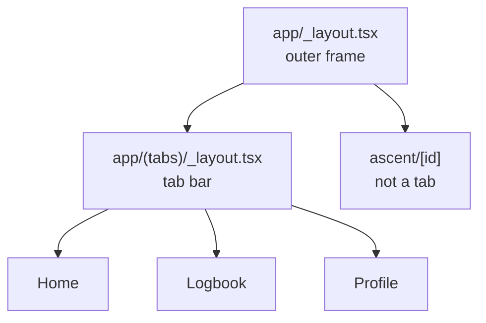
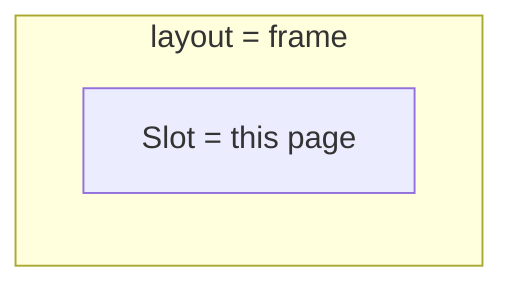

# Step 2 — Navigation shell

## Expo Router

Today the app is one screen: `App.tsx`. **Expo Router** turns **folders and files** into screens. You do not write a big navigation config first. You add a file, you get a route.

The special folder is `apps/mobile/app/` (not `src/screens`).

| File | What you get |
|------|----------------|
| `app/_layout.tsx` | Wrapper around every screen. Put TanStack Query and the test user here. |
| `app/(tabs)/_layout.tsx` | Bottom tabs. |
| `app/(tabs)/index.tsx` | Home tab (`/`) |
| `app/(tabs)/logbook.tsx` | Logbook tab |
| `app/(tabs)/profile.tsx` | Profile tab |
| `app/ascent/[id].tsx` | Detail screen. `[id]` is a changing value (one ascent). |

`(tabs)` is a **group**. The name does not appear in the URL. It only says “these screens share a tab bar.”

## `_layout` files

A **layout** is a frame. It is **not** a screen you tap. The **current page** sits inside it.

You need **two** frames. Keep them tiny.



**Outer frame** (`app/_layout.tsx`): wraps the whole app. Put `QueryClientProvider` here and `setUser` for the test climber. Then render `<Slot />` (or a Stack). `<Slot />` means “draw whichever page is open.”

**Tab frame** (`app/(tabs)/_layout.tsx`): only the bottom bar. Three tabs. No extra headers, no extra wrappers.



Home / Logbook / Profile live **inside** the tab frame. `ascent/[id]` lives **inside** the outer frame, **next to** tabs, so it can open on top without a fourth tab.

Do not nest more layouts. Do not put the tab bar in the outer file.

This step: install Expo Router (section below), create the `app/` files, stop using `App.tsx` as the entry.

You can open a screen later with something like `router.push('/ascent/123')`. You do not need that for tabs.

## Zustand

**Zustand** is a small box of state any screen can read. It is already in the project: `apps/mobile/src/store/useAuthStore.ts`.

| Tool | Holds |
|------|--------|
| Zustand | “Who is the test user on this phone?” |
| TanStack Query | Lists from the server (ascents) — **not this step** |

The store has `user`, `setUser`, `logout`. Any file can call `useAuthStore()`. You do not pass the user down through props.

This step is **not** login. At app start, put the seeded climber in the store (hardcode id / name / email from step 1). Profile reads that. `GET /api/users/test` comes in step 3.

The user lives **in memory**. Close the app, it resets. That is fine. No AsyncStorage.

## Metro bundler

**Metro** is the program that turns your TypeScript files into one bundle the phone (or web) can run. `npx expo start` starts Metro. The QR code / simulator talks to that process.

| Term | Meaning |
|------|---------|
| Bundler | Packs `import` files into something the app can load |
| Metro | Expo’s bundler (not Webpack, not Vite) |
| `web.bundler: "metro"` | Use Metro for **web** too, so you do not add Webpack |
| `npx expo start --clear` | Throw away Metro’s cache and start again |

Metro is **not** navigation. It only serves code. Expo Router decides **which screen** to show. If `main` is `expo-router/entry` and there is **no** `app/_layout.tsx` yet, Expo shows its own **Welcome to Expo** page. That is expected. `App.tsx` is no longer the entry, so you will not see the old climber list until you build the `app/` files.

## Install (mobile workspace)

Zustand is **already** installed. Do not add it again. Work in **`apps/mobile`**. Use `npx expo install` (not plain `npm install`) so versions match Expo 57.

**1. Packages**

```bash
cd apps/mobile
npx expo install expo-router react-native-safe-area-context react-native-screens expo-linking expo-constants expo-status-bar @expo/vector-icons
```

`react-native-web` and `react-dom` are already in this project. Skip them.

**2. Point Expo at the router**

In `apps/mobile/package.json`, change `main` from `expo/AppEntry.js` to:

```json
"main": "expo-router/entry"
```

After this, Expo loads `app/_layout.tsx`, not `index.ts` / `App.tsx`. If `app/` does not exist yet, you get the **Welcome to Expo** screen — not the old `App.tsx`. That is correct. Leave `index.ts` and `App.tsx` for now; delete them later when tabs work.

**3. App config**

In `apps/mobile/app.json`, inside `"expo": { ... }`, add:

```json
"scheme": "bouldering",
"plugins": ["expo-router"],
"web": {
  "favicon": "./assets/favicon.png",
  "bundler": "metro"
}
```

Keep the existing `web.favicon`. You are only adding `bundler` and the two new top-level keys (`scheme`, `plugins`).

**4. Restart with a clean cache**

```bash
npx expo start --clear
```

If you still see the **old** climber list from `App.tsx`, `main` was not saved, or you are not running from `apps/mobile`. Seeing **Welcome to Expo** with no `app/` folder is the success case for install.

Docs if something fails: [Expo Router manual install](https://docs.expo.dev/router/installation/). This project is SDK 57.

## Do

- Add `apps/mobile/app/_layout.tsx` with QueryClient + `setUser` for the test climber.
- Tabs: Home, Logbook, Profile.
- Stub `app/ascent/[id].tsx` (empty or “coming soon”).
- Profile shows Test Climber from Zustand.
- If `GET /api/health` fails, show one full-screen “No connection” message.

## Do not

- Ascent forms or S3.
- Real login.
- AsyncStorage.

## Done

Three tabs switch on simulator. Health fail → no-connection screen.

Then [03-ascent-api.md](03-ascent-api.md).
