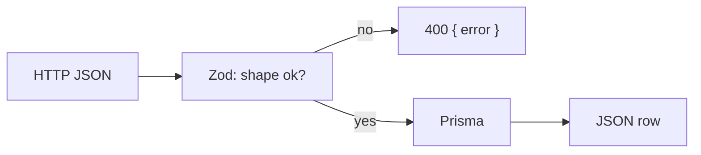

# Step 3 — Ascent API

This step is **server only**. The phone still uses stub screens. You add JSON routes that create, read, update, and delete ascents for the seeded test user.

Yes: show **request and response JSON** for each route. That is the contract. One small flow diagram is enough — do not draw a sequence for every verb.

## Zod

**Zod** checks JSON **before** it hits the database. Express does not know that `grade` must be a string. Zod does.

You write a small schema (the allowed shape). Zod parses `req.body`. If a required field is missing, you send **400** and stop. Prisma never runs.



Think of Zod as a bouncer. Prisma is the kitchen. Bad data never sits down.

Example of the idea (you will put this in `validations/`):

```ts
import { z } from 'zod';

export const createAscentBody = z.object({
  routeName: z.string().min(1),
  grade: z.string().min(1),
  attempts: z.number().int().min(0).optional(),
  completed: z.boolean().optional(),
  notes: z.string().optional(),
});
```

`PATCH` uses `.partial()` so every field is optional (you only send what changed). Do not accept `userId` or `imageKey` from the client in this step.

## Prisma (in the API)

You already drew the tables in step 1. **This step uses the generated client** in Express: `prisma.ascent.findMany()`, `.create()`, `.update()`, `.delete()`.

| Call | HTTP |
|------|------|
| `findMany({ where: { userId: TEST_USER_ID } })` | `GET /api/ascents` |
| `findUnique({ where: { id } })` | `GET /api/ascents/:id` |
| `create({ data: { ...parsed, userId: TEST_USER_ID } })` | `POST /api/ascents` |
| `update({ where: { id }, data: parsed })` | `PATCH /api/ascents/:id` |
| `delete({ where: { id } })` | `DELETE /api/ascents/:id` |

Always set `userId` on the **server** from the seed id. The phone does not send who the user is yet.

`prisma` is already created in `src/lib/prisma.ts`. Import it. Do not create a second client.

## Request / response shapes

Shared ascent object (what Postgres returns). Dates are ISO strings. Media stays `null`.

```json
{
  "id": "uuid",
  "routeName": "Orange Overhang",
  "grade": "V5",
  "attempts": 3,
  "completed": false,
  "notes": "need a higher foot",
  "imageKey": null,
  "videoKey": null,
  "userId": "00000000-0000-4000-8000-000000000001",
  "createdAt": "2026-08-18T12:00:00.000Z"
}
```

Errors (all of these):

```json
{ "error": "short message" }
```

| Status | When |
|--------|------|
| 400 | Zod failed, or bad id |
| 404 | No ascent with that id (for this user) |
| 500 | Database threw |

### `GET /api/users/test`

No body. **200** — the seed user (`id`, `email`, `name`, `createdAt`). Used later by the phone; add it now so the id lives in one place.

### `GET /api/ascents`

No body. **200** — JSON **array** of ascents for the test user only (`[]` if none).

### `POST /api/ascents`

```json
{
  "routeName": "Orange Overhang",
  "grade": "V5",
  "attempts": 1,
  "completed": false,
  "notes": "optional"
}
```

`attempts` / `completed` / `notes` may be omitted (defaults: `0`, `false`, `null`). **201** — one ascent object. **400** if `routeName` or `grade` is missing.

### `GET /api/ascents/:id`

No body. **200** — one object. **404** if it is missing or belongs to someone else.

### `PATCH /api/ascents/:id`

Send only fields to change:

```json
{ "completed": true, "attempts": 4 }
```

**200** — full updated object. **400** empty/invalid body. **404** if missing.

### `DELETE /api/ascents/:id`

No body. **204** empty, or **200** `{ "ok": true }`. Pick one and use it in tests. **404** if missing.

## Install (server workspace)

From `apps/server`:

```bash
npm install zod
```

Prisma is already installed.

## Do

- Put Zod schemas in `src/validations/`.
- Put route handlers in `src/app.ts` for now, or split `routes/` if the file gets noisy. Keep it readable.
- Tests in `tests/api.test.ts`: create, list, get one, patch, delete, and POST without `routeName` → 400.

## Do not

- Multipart file upload or `POST /api/uploads/presign`.
- Mobile forms (Postman or Vitest only).
- Accept `userId` from the body.

## Done

`npm run test:server` covers CRUD for the test user.

Then [04-logbook-crud.md](04-logbook-crud.md).
