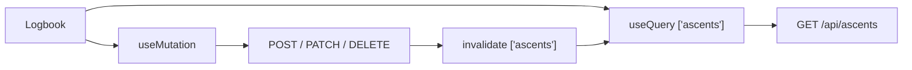

# Step 4 — Logbook CRUD UI

The API from step 3 is done. This step is the **phone**: show logs, then create / edit / delete them. TanStack Query is already in the app (`QueryClientProvider` in `app/_layout.tsx`). We did not explain it in step 2 — that is this section.

**First screen to build:** Logbook (`app/(tabs)/Logbook.tsx`). The file exists as a stub. Fill it in before Home stats or the detail form.

## TanStack Query

**TanStack Query** stores **server data** on the phone: lists, loading, errors. Zustand still only holds the test user. Do not put the ascent array in Zustand.

| Hook | Job |
|------|-----|
| `useQuery` | **Read** — `GET /api/ascents` |
| `useMutation` | **Write** — POST, PATCH, DELETE |

`queryKey: ['ascents']` is the name of the cached list. After a mutation, call `queryClient.invalidateQueries({ queryKey: ['ascents'] })` so the list refetches.



You already used `useQuery` for health in the root layout. Same idea, different key and `fetch` function.

Add `fetchAscents` (and later create/update/delete helpers) in `apps/mobile/src/api/client.ts`. Reuse `BASE_URL`.

## Logbook screen

Build this first. Tab **Logbook**. No photos yet. `+` opens create (can be the same form as edit). Tapping a row opens `ascent/[id]`.

Wireframe below is **100 characters wide**. Height follows the UI (a 200-line empty box is not useful).

```
+--------------------------------------------------------------------------------------------------+
|  9:41                                                                []  [wifi]  [100%]          |
+--------------------------------------------------------------------------------------------------+
|  Logbook                                                                                         |
+--------------------------------------------------------------------------------------------------+
|                                                                                                  |
|   My sends                                                                        [ + Log ]      |
|   3 climbs  ·  1 send                                                                            |
|                                                                                                  |
+--------------------------------------------------------------------------------------------------+
|                                                                                                  |
|  +--------------------------------------------------------------------------------------------+  |
|  |  Orange Overhang                                                              V5           |  |
|  |  3 attempts  ·  project                                                     Aug 18         |  |
|  |  need a higher foot                                                                        |  |
|  +--------------------------------------------------------------------------------------------+  |
|                                                                                                  |
|  +--------------------------------------------------------------------------------------------+  |
|  |  Slab Traverse                                                                V2           |  |
|  |  2 attempts  ·  SEND                                                        Aug 17         |  |
|  +--------------------------------------------------------------------------------------------+  |
|                                                                                                  |
|  +--------------------------------------------------------------------------------------------+  |
|  |  Warmup Jugs                                                                  V0           |  |
|  |  1 attempt  ·  SEND                                                         Aug 16         |  |
|  +--------------------------------------------------------------------------------------------+  |
|                                                                                                  |
|                         (scroll for more — same card shape)                                      |
|                                                                                                  |
+--------------------------------------------------------------------------------------------------+
|     ( Home )          ( * Logbook * )          ( Profile )                                       |
+--------------------------------------------------------------------------------------------------+
```

Empty state (no rows): one line in the middle — `No climbs yet` — and keep `[ + Log ]`.

Loading: spinner. Error: short text, no crash.

## Home screen

Same `useQuery` key `['ascents']` — **no extra API**. Compute on the phone:

| Number | How |
|--------|-----|
| Logged | `ascents.length` |
| Send rate | completed / total, as a percent (0 if empty) |
| This week | `createdAt` in the last 7 days (rolling) |

No feed, no gear, no second request. Empty list → three zeros.

```
+--------------------------------------------------------------------------------------------------+
|  9:41                                                                []  [wifi]  [100%]          |
+--------------------------------------------------------------------------------------------------+
|  Home                                                                                    [User]  |
+--------------------------------------------------------------------------------------------------+
|                                                                                                  |
|   This week                                                                                      |
|                                                                                                  |
|   +------------------------+  +------------------------+  +------------------------+             |
|   |  Logged                |  |  Send rate             |  |  This week             |             |
|   |  3                     |  |  33%                   |  |  2                     |             |
|   +------------------------+  +------------------------+  +------------------------+             |
|                                                                                                  |
|   Recent (2 most recent ascents)                                                                 |
|                                                                                                  |
|   +--------------------------------------------------------------------------------------------+ |
|   |  Orange Overhang  ·  V5  ·  project                                                        | |
|   +--------------------------------------------------------------------------------------------+ |
|   +--------------------------------------------------------------------------------------------+ |
|   |  Slab Traverse  ·  V2  ·  SEND                                                             | |
|   +--------------------------------------------------------------------------------------------+ |
|                                                                                                  |
|   (tap a row → same /ascent/[id] as Logbook)                                                     |
|                                                                                                  |
+--------------------------------------------------------------------------------------------------+
|     ( * Home * )          ( Logbook )          ( Profile )                                       |
+--------------------------------------------------------------------------------------------------+
```

Keep styling as plain as Logbook (borders, black/gray text).

## Install

None. `@tanstack/react-query` is already in `apps/mobile`. Do not add a UI kit.

## Do

1. **Logbook page** — match the wireframe; `useQuery` + `GET /api/ascents`.
2. Create / edit / delete from the phone (`useMutation` + invalidate).
3. Home stats from the **same** `['ascents']` query (count, send rate, this week).
4. `ascent/[id]` reads `GET /api/ascents/:id` (or the list item).
5. Leave `imageKey` / `videoKey` unused.

## Do not

- Image picker or AWS.
- New Zustand store for the list.
- JWT / login.

## Done

Full CRUD against Postgres as the test user. Restart the app; data is still there (server, not AsyncStorage).

Then [05-photo-upload.md](05-photo-upload.md).
