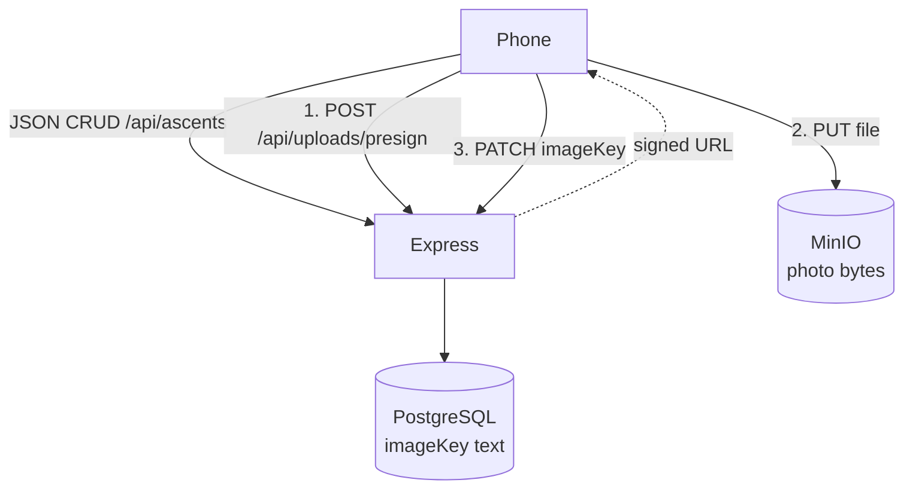
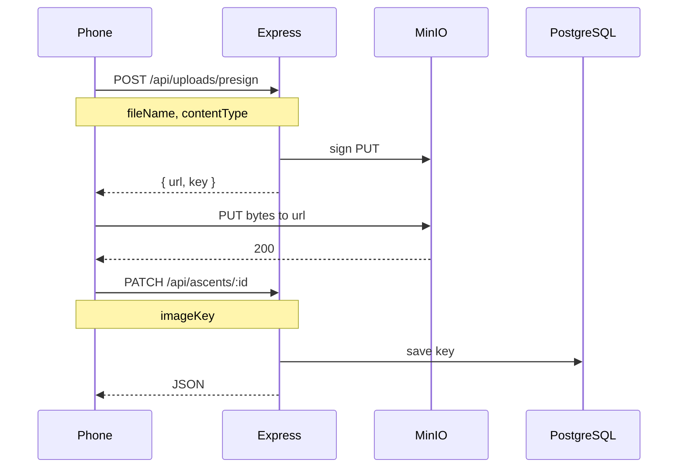

# Step 5 — Photo upload (presign)

## How this fits the app

Today the phone talks to Express, and Express talks to Postgres. That path is **JSON only**: logs, grades, notes. Photos are **bytes**. We do not put bytes in Postgres or in the Express request body.

**MinIO** (in Docker) pretends to be S3 on your machine. The AWS SDK still works. Later you change env vars and point at real AWS.



Plain English:

1. Phone asks Express: “I want to upload this file.”
2. Express does **not** take the file. It asks MinIO for a short-lived URL and a `key` (the object name).
3. Phone PUTs the photo **straight to MinIO**.
4. Phone PATCHes the ascent with `imageKey = key`. Postgres only stores that string.
5. To show the photo, the phone uses a signed GET URL (or a MinIO URL). The bucket stays private.



CORS: the browser/Expo web origin is not Express. MinIO must allow `PUT` from that origin. If CORS fails, fix MinIO — do not send the file through Express.

## MinIO with Docker

Same idea as Postgres in step 0: one container, then `.env`.

**1. Start MinIO**

PowerShell:

```powershell
docker run -d --name minio `
  -p 9000:9000 `
  -p 9001:9001 `
  -e MINIO_ROOT_USER=minioadmin `
  -e MINIO_ROOT_PASSWORD=minioadmin `
  minio/minio server /data --console-address ":9001"
```

If it already exists: `docker start minio`.

- API (SDK / PUT): `http://localhost:9000`
- Console (browser): `http://localhost:9001`  
  Login: `minioadmin` / `minioadmin`

**2. Create a private bucket**

In the console: **Buckets → Create bucket**. Name it `bouldering`. Leave it **private** (not anonymous download).

**3. CORS** (needed when Expo **web** PUTs from the browser)

There is **no CORS button** in the MinIO community console. Bucket CORS (`PutBucketCors`) is an AIStor/paid API and returns `501 NotImplemented`. You do not need it.

Community MinIO already has **global** CORS. It reflects the browser origin (including Expo on `8081` or whatever port Metro picked, e.g. `8650`).

In DevTools **Network**:

- `POST http://localhost:4000/api/uploads/presign` — Express signs the URL
- `OPTIONS` / `PUT http://localhost:9000/bouldering/...` — the file. Filter for `9000`, not `4000`
- `GET /api/ascents` with **304** is only the logbook cache. It is not the upload.

Metro / `npm run dev:mobile` will not print the MinIO PUT. Use the **browser** console (F12), not the terminal.

To confirm CORS from `apps/server` (optional):

```bash
npm run minio:cors
npm run minio:cors -- http://localhost:8650
```

**4. Server `.env`** (`apps/server/.env` — do not commit)

```
AWS_REGION=us-east-1
AWS_ACCESS_KEY_ID=minioadmin
AWS_SECRET_ACCESS_KEY=minioadmin
AWS_ENDPOINT=http://localhost:9000
S3_BUCKET=bouldering
```

The SDK must use **path-style** URLs (`forcePathStyle: true`). MinIO is not `bucket.s3.amazonaws.com`.

**5. Phone vs `localhost`**

Express signs a URL. The **phone** then opens that URL. Android emulator cannot use `localhost` for MinIO (same as the API). You will need a host the device can reach, for example:

- Android emulator: `http://10.0.2.2:9000`
- iOS simulator: `http://localhost:9000`

A second env var such as `S3_PUBLIC_ENDPOINT` (the host baked into the signed URL) is the usual fix. `AWS_ENDPOINT` stays what **Express** uses to talk to Docker.

**6. Smoke check**

Console → bucket → you should see objects appear after a successful PUT. If the API works but the bucket is empty, the phone never reached MinIO (URL host or CORS).

## Learn

- Express signs a URL. The phone PUTs bytes to MinIO/S3. Then the phone PATCHes `imageKey`.
- CORS errors are expected the first time. Fix the bucket. Do not switch to proxy upload.

## Install

No extra web library. **`expo-image-picker` works on iOS, Android, and web.** On web it opens the browser file picker (`<input type="file">`). Do not add `react-dropzone` or a second uploader.

On web, call `launchImageLibraryAsync` from a **button press** (browsers block it otherwise). The result includes a `File` you can PUT to MinIO. Same presign flow as the phone.

**1. Server packages** (from `apps/server`):

```bash
npm install @aws-sdk/client-s3 @aws-sdk/s3-request-presigner
```

**2. Mobile packages** (from `apps/mobile` — use `expo install` so the version matches SDK 57):

```bash
npx expo install expo-image-picker
```

**3. Expo config** — in `apps/mobile/app.json`, add the plugin next to `expo-router` (library pick only; camera not required):

```json
"plugins": [
  "expo-router",
  "expo-status-bar",
  [
    "expo-image-picker",
    {
      "photosPermission": "Allow Boulder Logs to pick a climb photo."
    }
  ]
]
```

Restart Metro after that: `npx expo start --clear`.

**4. MinIO** is Docker, not npm. Finish the MinIO section above first. Real AWS later: drop `AWS_ENDPOINT`.

## Do

- `POST /api/uploads/presign` body: `{ fileName, contentType }` → `{ url, key }`.
- Phone: pick image → PUT to `url` → PATCH ascent `imageKey`.
- Show the photo on detail (signed GET is safer than a public bucket).
- Helper takes `contentType` so step 6 can pass `video/mp4`.

## Do not

- Send the file to Express.
- Record video.
- Make the bucket public.

## Done

After restart, the log still shows the photo.

Then [06-video-upload.md](06-video-upload.md).
